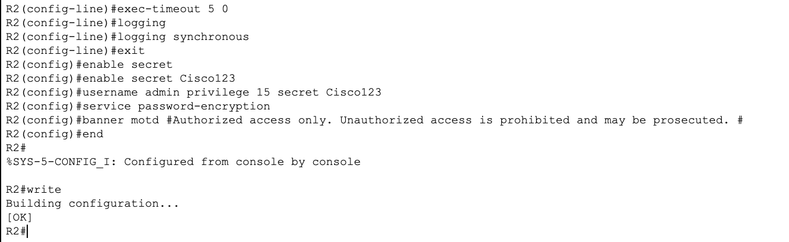
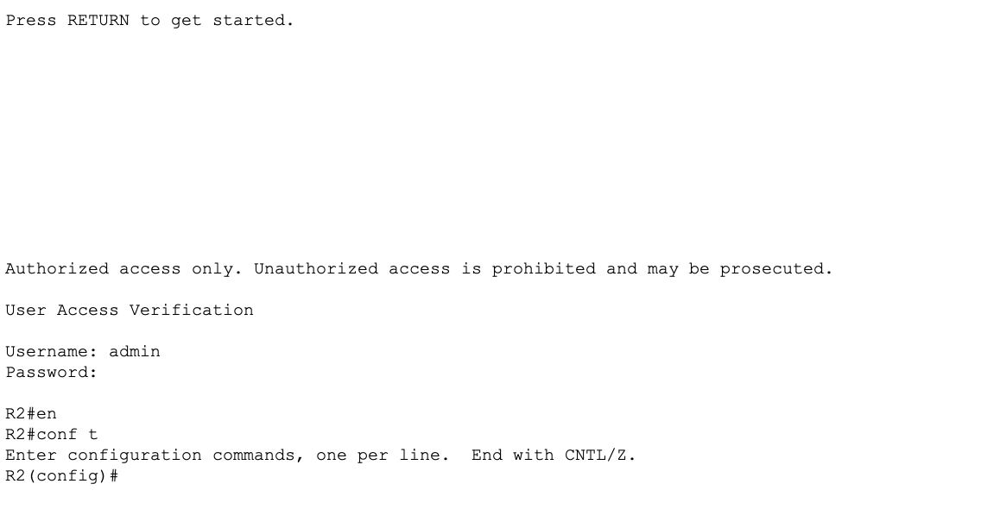
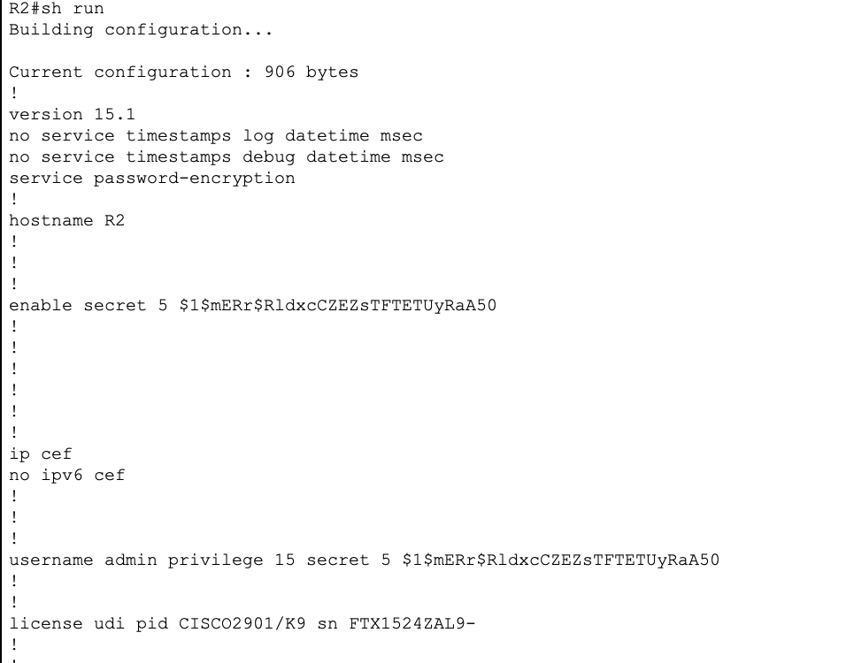

# Lab 01 - Device Initialization and Basic Hardening

## Objective

Configure foundational security settings on all four devices before any network services are brought up. This phase establishes the baseline security posture that every professional network configuration starts with.

## Devices Configured

| Device | Type | Hostname |
|---|---|---|
| Router 1 | Cisco ISR 4331 | R1 |
| Router 2 | Cisco ISR 4331 | R2 |
| Switch 1 | Cisco 2960 | SW1 |
| Switch 2 | Cisco 2960 | SW2 |

## Topology

No cable connections required for this phase. Each device is configured independently. Full topology connections begin in Lab 02.

```
[ R1 ]    [ R2 ]    [ SW1 ]    [ SW2 ]
```

## Tools Used

- Cisco Packet Tracer
- Cisco IOS CLI

---

## Configuration Steps

All 8 steps below were applied to R1, R2, SW1, and SW2. R2 configuration's are included below as examples.

---

### Step 1 - Hostname

Sets the device name. The prompt changes immediately after, confirming the command took effect.

```
enable
configure terminal
hostname R2
```

**Verification:** The CLI prompt changes from `Router#` to `R2#` instantly.

---

### Step 2 - Console Line Security

Secures the physical console port with local authentication, idle timeout, and synchronized logging.

```
line con 0
 login local
 exec-timeout 5 0
 logging synchronous
exit
```

| Command | Purpose |
|---|---|
| `login local` | Requires username and password from local database |
| `exec-timeout 5 0` | Logs out after 5 minutes, 0 seconds of inactivity |
| `logging synchronous` | Prevents console messages from interrupting typed commands |

**login vs login local:** `login` uses a single line password set with the `password` command. `login local` uses the full username and password database, which is more secure and ties authentication to specific accounts.



---

### Step 4 - Enable Secret

Sets the encrypted password required to enter privileged exec mode.

```
enable secret Cisco123!
```

**enable password vs enable secret:** `enable password` stores the password in plaintext or weak type 7 encryption. `enable secret` always uses MD5 (type 5) regardless of whether `service password-encryption` is on. If both are configured, `enable secret` always takes priority and `enable password` is ignored.

---

### Step 5 - Local Username and Password

Creates a local user account with full administrative access.

```
username admin privilege 15 secret Cisco123!
```

| Part | Meaning |
|---|---|
| `username admin` | The login name |
| `privilege 15` | Highest privilege level, full access |
| `secret Cisco123!` | Encrypted password for this account |

**Privilege levels:** Cisco IOS has 16 privilege levels (0 through 15). Level 15 is full access. Level 1 is user exec mode (limited read-only). Levels 2 through 14 are customizable.

**password vs secret in username command:** `password` stores in plaintext or type 7. `secret` uses MD5 encryption. Always use `secret`.

---

### Step 6 - Service Password Encryption

Encrypts all plaintext passwords visible in the running configuration.

```
service password-encryption
```

**What it protects:** Any passwords set with the `password` command that would otherwise appear in plaintext in `show running-config`. This uses type 7 encryption, which is weak and reversible, but better than plaintext.

**What it does NOT protect:** `enable secret` and `username secret` are already encrypted with MD5 and are not affected by this command.

**Is it strong encryption?** No. Type 7 can be decoded with free online tools. It is a deterrent, not real security. The value is preventing shoulder-surfing and casual exposure, not protecting against a determined attacker with config access.

---

### Step 7 - Banner MOTD

Displays a warning message to anyone who connects to the device before they log in.

```
banner motd #
Authorized access only. Unauthorized access is prohibited and may be prosecuted.
#
```

**MOTD stands for:** Message of the Day.

**The delimiter character:** The `#` tells the router where the banner message begins and ends. You can use any character that does not appear in your message text.

**Why banners matter legally:** Without a warning banner, unauthorized users can argue they did not know access was restricted. A banner establishes legal notice, which is required in most jurisdictions to pursue prosecution for unauthorized access.



---

### Step 8 - Save Configuration

Saves the running configuration to NVRAM so it survives a reboot.

```
end
copy running-config startup-config
```

Press Enter when prompted for the destination filename.

**Three ways to save:**

| Command | Notes |
|---|---|
| `copy running-config startup-config` | Full explicit command |
| `write memory` | Shorthand, same result |
| `write` | Shortest form, same result |

**Memory locations:**

| Config | Storage | Survives reboot? |
|---|---|---|
| Running config | RAM | No |
| Startup config | NVRAM | Yes |
| IOS image | Flash | Yes |

---

## Full Verification

After completing all 8 steps on all 4 devices, run `show running-config` on each device and confirm the following are present:

```
show running-config
```

| Item | What to look for |
|---|---|
| Hostname | Top line of config |
| DNS disabled | `no ip domain-lookup` |
| Enable secret | `enable secret 5 $1$...` (encrypted) |
| Local user | `username admin privilege 15 secret 5 $1$...` |
| Password encryption | `service password-encryption` |
| Banner | `banner motd` with your message |
| Console line | `login local`, `exec-timeout 5 0`, `logging synchronous` |



---

## Lessons Learned

- `enable secret` always wins over `enable password` if both are configured. There is no reason to use `enable password` in a modern network.
- `service password-encryption` uses type 7 which is reversible. It is a deterrent, not real protection. Real security comes from using `secret` on all password commands.
- `logging synchronous` is a small quality-of-life setting that makes a big difference when working in a busy console session.
- `exec-timeout 5 0` is a security best practice. An unattended logged-in console is an open door.
- Saving config is easy to forget. Make `copy run start` the last command of every lab session.
- The banner is not just a formality. In a real network environment it is a legal requirement before any security enforcement can hold up.

---
