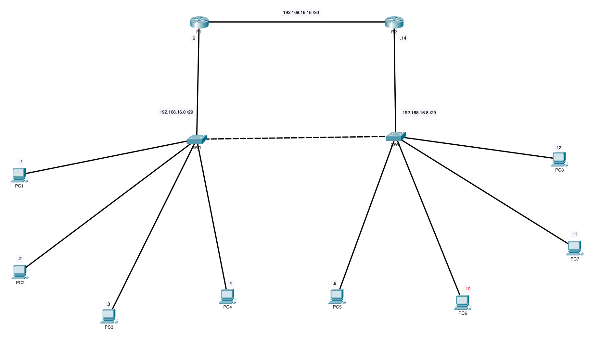
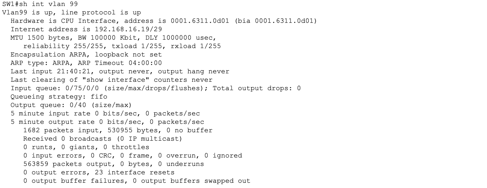
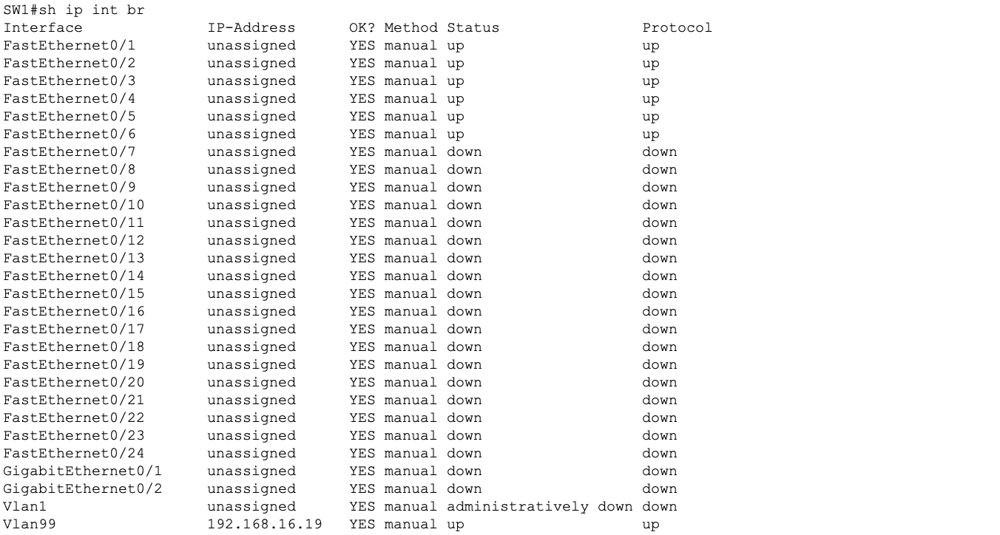
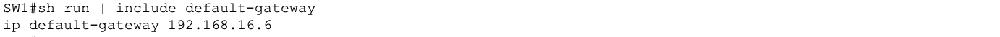
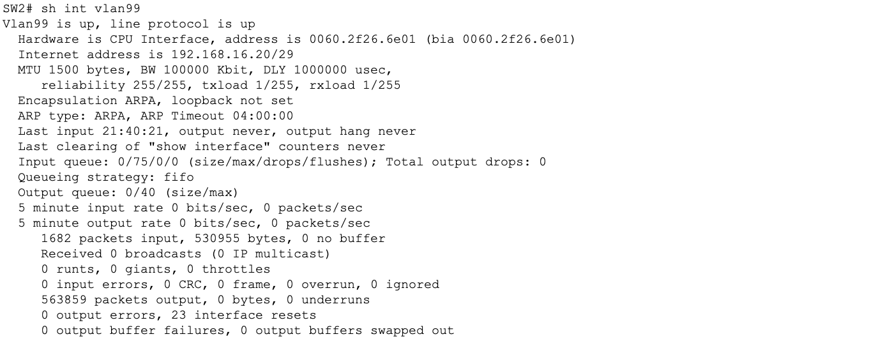
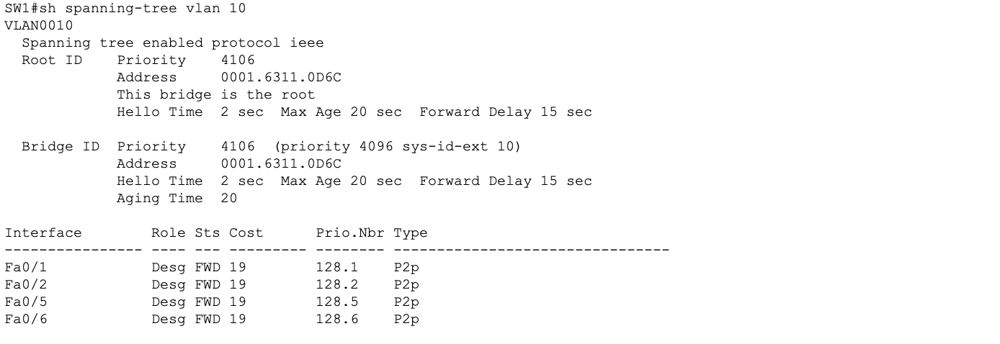
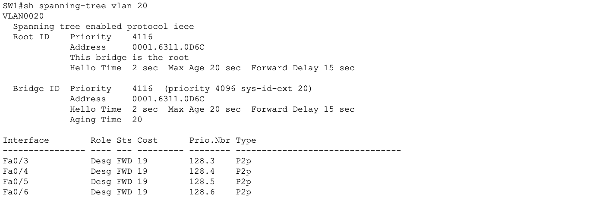

# Lab 03 - SVI Management IP and Spanning Tree Configuration

## Objective

Configure Switch Virtual Interfaces (SVIs) on both switches to enable remote management, set default gateways so switches can communicate outside their local subnet, and configure Spanning Tree Protocol to establish SW1 as the root bridge with PortFast and BPDU Guard enabled on all access ports.

## Devices Configured

| Device | Type | Role |
|---|---|---|
| SW1 | Cisco 2960 | Access layer switch, STP root bridge |
| SW2 | Cisco 2960 | Access layer switch, STP non-root |
| R1 | Cisco ISR 4331 | Default gateway for SW1 |
| R2 | Cisco ISR 4331 | Default gateway for SW2 |

## Topology

All configurations are applied to the existing topology built in Labs 01 and 02.



## Addressing

| Device | Interface | IP Address | Subnet Mask | Purpose |
|---|---|---|---|---|
| SW1 | Vlan99 | 192.168.16.19 | 255.255.255.248 | Management SVI |
| SW2 | Vlan99 | 192.168.16.20 | 255.255.255.248 | Management SVI |
| SW1 | Default gateway | 192.168.16.6 | N/A | R1 G0/0 |
| SW2 | Default gateway | 192.168.16.14 | N/A | R2 G0/0 |

## Tools Used

- Cisco Packet Tracer
- Cisco IOS CLI

---

## Part 1 - SVI Configuration

---

### What is an SVI and why do we need one?

A Switch Virtual Interface is a virtual Layer 3 interface on a switch that can be assigned an IP address. By default a switch has no IP address and is invisible on the network; You cannot SSH into it or ping it remotely. The SVI gives the switch a management presence on the network.

We use VLAN 99 specifically for management because it keeps management traffic completely isolated from user traffic on VLAN 10 and VLAN 20. This is a security best practice; If an attacker compromises a user VLAN they still cannot reach the switch management plane.

---

### Why does a switch need a default gateway but a router does not?

A router has a full routing table and knows how to forward packets between networks. A switch has no routing table; it only knows about its directly connected VLAN. Without a default gateway the switch cannot send traffic outside its local subnet, meaning remote management from a different network would be impossible.

---

### Step 1 - SVI Configuration on SW1

```
enable
configure terminal
interface vlan 99
 ip address 192.168.16.19 255.255.255.248
 no shutdown
exit
ip default-gateway 192.168.16.6
```

| Command | Purpose |
|---|---|
| `interface vlan 99` | Creates the SVI for VLAN 99 -- a virtual Layer 3 interface |
| `ip address 192.168.16.19 255.255.255.248` | Assigns the management IP address |
| `no shutdown` | SVIs are administratively down by default, this brings them up |
| `ip default-gateway 192.168.16.6` | Points to R1 G0/0 -- the directly connected router interface on SW1's subnet |

**Why does the SVI need no shutdown?**
Unlike physical interfaces that come up automatically when a cable is plugged in, SVIs start in a shutdown state. The SVI will also only reach up/up status if at least one physical port assigned to VLAN 99 is active and forwarding.

**Verify:**

```
show interface vlan 99
show ip interface brief
show running-config | include default-gateway
```







---

### Step 2 - SVI Configuration on SW2

```
enable
configure terminal
interface vlan 99
 ip address 192.168.16.20 255.255.255.248
 no shutdown
exit
ip default-gateway 192.168.16.14
```

**Default gateway set to 192.168.16.14 -- R2's G0/0 interface, which is the directly connected router on SW2's subnet.**

**Verify:**

```
show interface vlan 99
show ip interface brief
show running-config | include default-gateway
```



---

### SVI Verification Summary

| Device | SVI Interface | IP Address | Status |
|---|---|---|---|
| SW1 | Vlan99 | 192.168.16.19 | up/up |
| SW2 | Vlan99 | 192.168.16.20 | up/up |

---

## Part 2 - Spanning Tree Configuration

---

### What is Spanning Tree Protocol?

STP (IEEE 802.1D) is a Layer 2 protocol that prevents switching loops. In a network with redundant links between switches, frames could loop indefinitely causing a broadcast storm that would bring down the network. STP solves this by blocking redundant paths and only activating them if the primary path fails.

---

### How is the root bridge elected?

Every switch has a Bridge ID made up of two parts: Bridge priority and MAC address. The switch with the lowest Bridge ID wins the election and becomes the root bridge. The default priority on all switches is 32768. Since all switches start equal, the tiebreaker is the MAC address with the lowest MAC winning.

To guarantee SW1 becomes root we manually lower its priority to 4096, which is well below the default 32768 on SW2.

**Valid priority values:** Must be in multiples of 4096 -- 0, 4096, 8192, 12288, 16384, 20480, 24576, 28672, 32768 (default).

---

### Step 2 - Make SW1 Root Bridge for VLAN 10 and VLAN 20

```
configure terminal
spanning-tree vlan 10 priority 4096
spanning-tree vlan 20 priority 4096
exit
```

**Verify:**

```
show spanning-tree vlan 10
show spanning-tree vlan 20
```

Look for this line in the output confirming SW1 won the election:

```
This bridge is the root
```





---

### Step 3 - PortFast on All Access Ports

**On SW1:**

```
configure terminal
interface range Fa0/1 - 4
 spanning-tree portfast
exit
```

**On SW2:**

```
configure terminal
interface range Fa0/1 - 4
 spanning-tree portfast
exit
```

**What does PortFast do?**

Normally when a port comes up STP runs it through two states before allowing traffic:

| STP State | Duration | Purpose |
|---|---|---|
| Listening | 15 seconds | Receiving BPDUs, not forwarding |
| Learning | 15 seconds | Building MAC table, not forwarding |
| Forwarding | Active | Passing traffic |

This means a PC takes 30 seconds to get network access after plugging in. PortFast skips Listening and Learning and puts the port directly into Forwarding instantly.

**When is PortFast safe to use?**
Only on access ports connected to end devices like PCs and printers. Never on ports connected to other switches. End devices never send BPDUs so there is no risk of a loop.

---

### Step 4 - BPDU Guard on All Access Ports

**On SW1:**

```
configure terminal
interface range Fa0/1 - 4
 spanning-tree bpduguard enable
exit
```

**On SW2:**

```
configure terminal
interface range Fa0/1 - 4
 spanning-tree bpduguard enable
exit
```

**What does BPDU Guard do?**

BPDUs are the messages switches send to each other to run STP. A PC or end device should never send a BPDU. If a port with BPDU Guard receives a BPDU it immediately shuts the port down and places it into err-disabled state.

This prevents someone from plugging a rogue switch into an access port and attempting to manipulate the STP topology to become root bridge which is a real attack vector in enterprise networks.

**What does err-disabled mean?**
The port is completely shut down by the switch as a security or error response. It will not recover automatically. An administrator must manually recover it:

```
interface Fa0/1
 shutdown
 no shutdown
```

---

### Save Configuration on Both Switches

```
end
copy running-config startup-config
```

---

## Full Verification Command Output

### SW1 Verification

```
show interface vlan 99
show ip interface brief
show running-config | include default-gateway
show spanning-tree vlan 10
show spanning-tree vlan 20
show running-config | include portfast
show running-config | include bpduguard
```

### SW2 Verification

```
show interface vlan 99
show ip interface brief
show running-config | include default-gateway
```

---

## Key Concepts

**What is an SVI?**
A Switched Virtual Interface is a virtual Layer 3 interface on a switch that allows the switch to have an IP address for management purposes. One SVI per VLAN can be created.

**Why use a dedicated management VLAN?**
Separating management traffic from user traffic prevents users from accessing the switch management plane and limits the blast radius if a user VLAN is compromised.

**What is the default STP bridge priority?**
32768 on all Cisco switches. Must be manually lowered on the intended root bridge.

**What happens if PortFast is enabled on a trunk port?**
It is a misconfiguration that can cause temporary loops during topology changes. PortFast should only ever be configured on access ports facing end devices.

**How do you recover an err-disabled port?**
Manually shut it down and bring it back up with shutdown followed by no shutdown. Optionally configure err-disable recovery to automate this with a timer.

---

## Lessons Learned

- SVIs are administratively down by default and require no shutdown to become active
- An SVI only reaches up/up if at least one physical port in that VLAN is active
- Switches need a default gateway to communicate outside their local subnet -- routers do not
- The default gateway on a switch should always point to the directly connected router interface
- STP priority must be set in multiples of 4096 -- any other value is rejected by IOS
- PortFast eliminates the 30 second STP convergence delay on access ports
- BPDU Guard is a critical security control that prevents rogue switch attacks on access ports
- err-disabled ports do not recover automatically -- manual intervention is always required
- Always verify STP root bridge status with show spanning-tree and confirm the This bridge is the root line
