# Lab 04 - Port Security, DHCP Snooping, and Dynamic ARP Inspection

## Objective

Configure three critical Layer 2 security features on SW1 and SW2: port security to restrict which devices can connect to access ports, DHCP snooping to prevent rogue DHCP servers from handing out fake addresses, and Dynamic ARP Inspection to block ARP spoofing attacks. A live simulation is included to demonstrate port security triggering a real violation and recovery.

## Devices Configured

| Device | Type | Role |
|---|---|---|
| SW1 | Cisco 2960 | Layer 2 security enforcement, access layer |
| SW2 | Cisco 2960 | Layer 2 security enforcement, access layer |

## Topology

All configuration is applied to the existing topology built in Labs 01 through 03. A temporary rogue PC is added to SW1 Fa0/1 during the port security simulation and removed afterward.


## Tools Used

- Cisco Packet Tracer
- Cisco IOS CLI
- Packet Tracer Simulation Mode

---

## Part 1 - Port Security

---

### What is port security and why do we need it?

Port security restricts which devices can connect to a switch access port based on MAC address. Without it anyone can walk up to an open port, plug in a device, and immediately gain network access. Port security locks each port to a specific MAC address and shuts the port down if an unauthorized device is detected.

### What is sticky MAC learning?

When sticky learning is configured the switch dynamically learns the MAC address of the first device that connects and automatically saves it to the running configuration as a permanent secure MAC. This means you do not have to manually type every MAC address in your network while still locking each port to one specific device.

### The three violation modes

| Mode | What happens | Port shuts down | Counter increments | Syslog sent |
|---|---|---|---|---|
| Shutdown | Port goes err-disabled | Yes | Yes | Yes |
| Restrict | Drops violating frames, port stays up | No | Yes | Yes |
| Protect | Drops violating frames silently | No | No | No |

Shutdown is the most secure and is industry best practice for access ports.

---

### Step 1 - Port Security Configuration on SW1

Applied to all PC-facing access ports Fa0/1 through Fa0/4.

```
enable
configure terminal
interface range Fa0/1 - 4
 switchport port-security
 switchport port-security maximum 1
 switchport port-security mac-address sticky
 switchport port-security violation shutdown
exit
```

| Command | Purpose |
|---|---|
| `switchport port-security` | Enables port security on the interface |
| `switchport port-security maximum 1` | Allows only 1 MAC address per port |
| `switchport port-security mac-address sticky` | Dynamically learns and saves the first MAC that connects |
| `switchport port-security violation shutdown` | Puts port into err-disabled state if a second MAC is detected |

**Verify:**

```
show port-security
show port-security interface Fa0/1
```

To trigger MAC learning run a ping from PC1 first:

```
ping 192.168.16.6
```

Then check that the sticky MAC has been learned:

```
show port-security interface Fa0/1
show running-config | include sticky
```

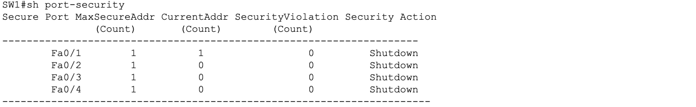

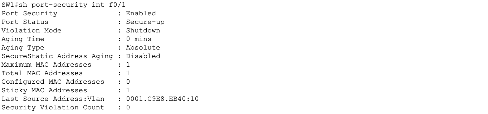

---

### Step 2 - Port Security Configuration on SW2

Applied to all PC-facing access ports Fa0/5 through Fa0/8.

```
enable
configure terminal
interface range Fa0/5 - 8
 switchport port-security
 switchport port-security maximum 1
 switchport port-security mac-address sticky
 switchport port-security violation shutdown
exit
```

**Verify:**

```
show port-security
```


---

## Part 2 - Port Security Simulation

### What we are proving

A rogue device plugged into a port that already has a sticky MAC learned will immediately trigger a violation and cause the port to go err-disabled. This proves port security is actively enforcing MAC restrictions in real time.

---

### Simulation Topology

The following screenshot shows the rogue PC temporarily connected to SW1 Fa0/1 alongside the existing topology during the port security violation test.

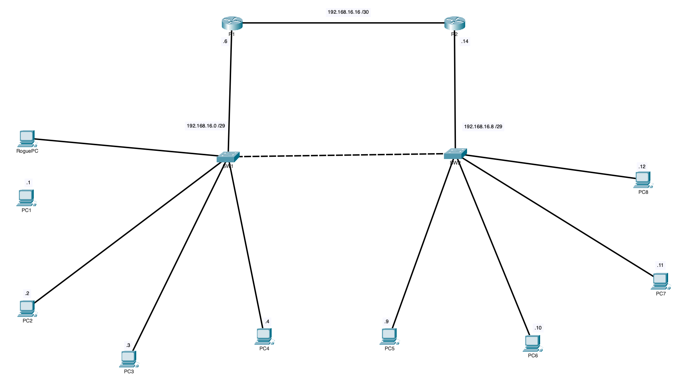

### Simulation Steps

**Step 1 - Confirm sticky MAC is learned on SW1 Fa0/1**

Before connecting the rogue PC confirm SW1 has already learned PC1's MAC:

```
show port-security interface Fa0/1
```

Confirm the output shows:

```
Port Status: Secure-up
Sticky MAC Address: xxxx.xxxx.xxxx
```

---

**Step 2 - Configure the rogue PC**

Add a new PC to the Packet Tracer canvas. Assign it a static IP in the same subnet:

```
IP Address:      192.168.16.3
Subnet Mask:     255.255.255.248
Default Gateway: 192.168.16.6
```

---

**Step 3 - Disconnect PC1 and connect the rogue PC to SW1 Fa0/1**

The port already has PC1's MAC locked in via sticky learning. The rogue PC has a completely different MAC address.

---

**Step 4 - Generate traffic from the rogue PC**

Click the rogue PC, go to Desktop, Command Prompt:

```
ping 192.168.16.6
```

This sends frames with the rogue PC's MAC address out of SW1 Fa0/1. That MAC does not match the sticky MAC saved from PC1 so a violation is triggered immediately.

---

**Step 5 - Verify the violation on SW1**

```
show port-security interface Fa0/1
show interfaces Fa0/1
```

Expected output confirms the violation:

```
Port Status: Secure-shutdown
Security Violation Count: 1
Last Source Address: xxxx.xxxx.xxxx
```

```
Fa0/1 is down, line protocol is down (err-disabled)
```

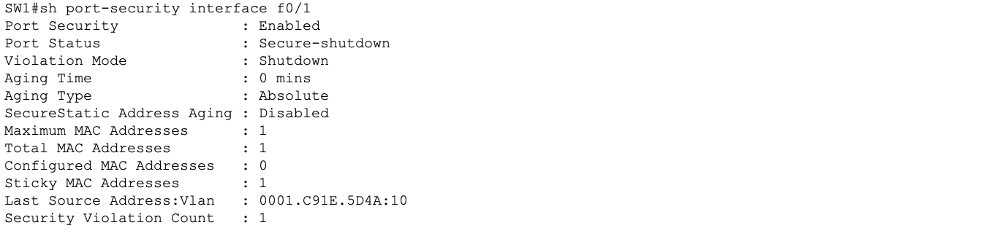

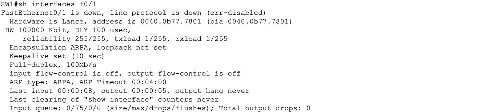

### Syslog Messages

The following syslog output was captured on SW1 during the violation event. These messages confirm the sequence of events as the port detected the unauthorized MAC address and transitioned to err-disabled state.

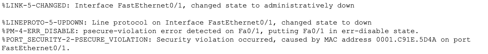

The syslog messages confirm three events in order:

| Syslog Event | What it means |
|---|---|
| Security violation detected | Switch identified a MAC address that does not match the sticky learned address |
| Port moved to err-disabled | Violation mode shutdown executed automatically |
| Interface administratively down | Port is fully disabled and requires manual recovery |

---

**Step 6 - Recover the err-disabled port**

Disconnect the rogue PC and reconnect PC1 to Fa0/1. Then manually recover the port:

```
configure terminal
interface Fa0/1
 shutdown
 no shutdown
exit
```

**Verify recovery:**

```
show port-security interface Fa0/1
show interfaces Fa0/1
```

Port status should return to Secure-up and the interface should show up/up.

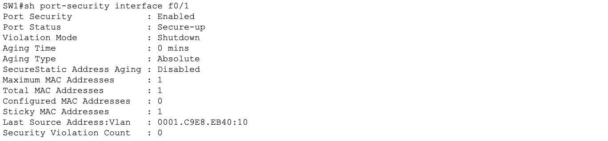

---

### Port Security Simulation Summary

| Event | Result | Confirms |
|---|---|---|
| PC1 connects and pings | Sticky MAC learned | Port security is active and learning |
| Rogue PC connects and pings | Port goes err-disabled | Violation mode shutdown is working |
| Shutdown and no shutdown on Fa0/1 | Port recovers to Secure-up | Manual recovery procedure works |

---

## Part 3 - DHCP Snooping

---

### What is DHCP snooping and what attack does it prevent?

DHCP snooping prevents rogue DHCP server attacks. In a standard network any device can be configured as a DHCP server and start handing out fake IP addresses, wrong default gateways, or malicious DNS servers to clients. DHCP snooping stops this by classifying every switch port as either trusted or untrusted.

Trusted ports are allowed to send DHCP server responses (Offer and Acknowledge). Untrusted ports can only send DHCP client messages (Discover and Request). Any DHCP Offer arriving on an untrusted port is dropped immediately.

### Which ports are trusted and which are untrusted?

| Port | Trust Level | Reason |
|---|---|---|
| SW1 Fa0/5 | Trusted | Uplink to R1, legitimate DHCP server location |
| SW1 Fa0/6 | Trusted | Trunk to SW2, carries legitimate DHCP traffic |
| SW1 Fa0/1 to Fa0/4 | Untrusted | PC-facing ports, no server should be here |
| SW2 Fa0/1 | Trusted | Uplink to R2 |
| SW2 Fa0/2 | Trusted | Trunk to SW1 |
| SW2 Fa0/5 to Fa0/8 | Untrusted | PC-facing ports |

---

### Step 1 - DHCP Snooping Configuration on SW1

```
configure terminal
ip dhcp snooping
ip dhcp snooping vlan 10,20
no ip dhcp snooping information option
interface Fa0/5
 ip dhcp snooping trust
interface Fa0/6
 ip dhcp snooping trust
exit
```

| Command | Purpose |
|---|---|
| `ip dhcp snooping` | Enables DHCP snooping globally on the switch |
| `ip dhcp snooping vlan 10,20` | Activates snooping specifically for VLAN 10 and VLAN 20 |
| `no ip dhcp snooping information option` | Disables option 82 which causes packet drops in routed environments |
| `ip dhcp snooping trust` on uplinks | Marks the port as trusted for DHCP server responses |

**Verify:**

```
show ip dhcp snooping
```

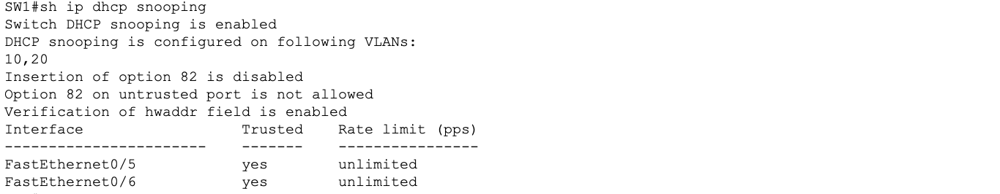

---

### Step 2 - DHCP Snooping Configuration on SW2

```
configure terminal
ip dhcp snooping
ip dhcp snooping vlan 10,20
no ip dhcp snooping information option
interface Fa0/1
 ip dhcp snooping trust
interface Fa0/2
 ip dhcp snooping trust
exit
```

**Verify:**

```
show ip dhcp snooping
```

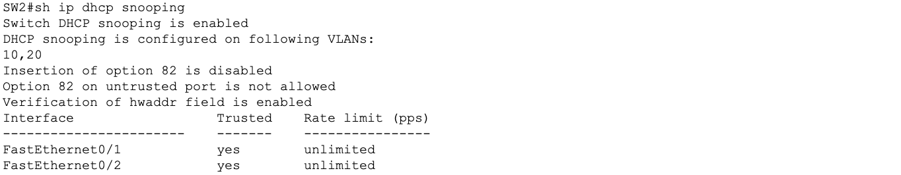

Note: The DHCP snooping binding table will be empty at this stage because R1 has not been configured as a DHCP server yet. The binding table will populate with real IP to MAC mappings in Lab 07 when the DHCP server is configured. The simulation exercise proving DHCP snooping blocks rogue servers is also reserved for Lab 07.

---

## Part 4 - Dynamic ARP Inspection

---

### What attack does DAI prevent?

DAI prevents ARP spoofing (also called ARP poisoning). ARP has no built-in authentication -- any device on a network can send a fake ARP reply claiming that a particular IP address belongs to its MAC address. An attacker uses this to redirect traffic intended for another host through their own machine, enabling man-in-the-middle attacks.

### How does DAI work?

DAI intercepts all ARP packets on untrusted ports and validates them against the DHCP snooping binding table. The binding table records which IP address was assigned to which MAC address on which port. If an ARP reply claims an IP to MAC mapping that does not match the binding table, DAI drops the packet as a spoofed ARP.

This is why DHCP snooping must always be configured before DAI -- DAI depends on the binding table that DHCP snooping builds.

### Which ports should be trusted for DAI?

The same ports trusted for DHCP snooping. Uplinks to routers and interswitch trunks are trusted. All PC-facing access ports are untrusted.

---

### Step 1 - DAI Configuration on SW1

```
configure terminal
ip arp inspection vlan 10,20
interface Fa0/5
 ip arp inspection trust
interface Fa0/6
 ip arp inspection trust
exit
```

| Command | Purpose |
|---|---|
| `ip arp inspection vlan 10,20` | Enables DAI for VLAN 10 and VLAN 20 |
| `ip arp inspection trust` on uplinks | ARP packets on these ports are not inspected |

**Verify:**

```
show ip arp inspection
show ip arp inspection vlan 10
show ip arp inspection vlan 20
```

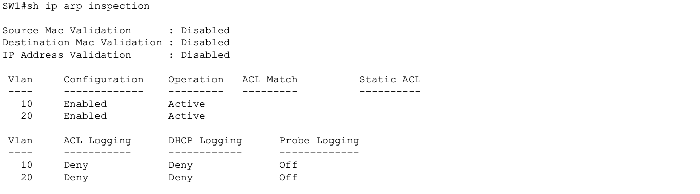

---

### Step 2 - DAI Configuration on SW2

```
configure terminal
ip arp inspection vlan 10,20
interface Fa0/1
 ip arp inspection trust
interface Fa0/2
 ip arp inspection trust
exit
```

**Verify:**

```
show ip arp inspection
```

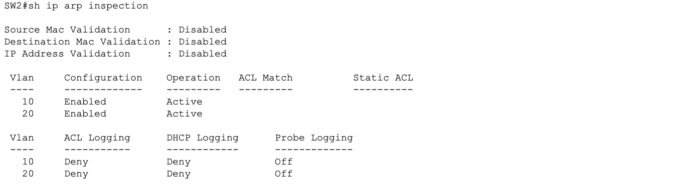

Note: The DAI simulation exercise proving spoofed ARP packets are dropped is reserved for Lab 07 when the DHCP snooping binding table has real entries to validate against. DAI validation is only meaningful when the binding table is populated.

---

### Save Configuration on Both Switches

```
end
copy running-config startup-config
```

---

## Layer 2 Security Summary

| Feature | Protects Against | Configured On | Trusted Ports |
|---|---|---|---|
| Port Security | Unauthorized device access via MAC | All access ports | N/A |
| DHCP Snooping | Rogue DHCP server attacks | VLAN 10 and 20 | Uplinks and trunks |
| DAI | ARP spoofing and man-in-the-middle | VLAN 10 and 20 | Uplinks and trunks |

---

## Key Concepts

**What does err-disabled mean?**
A port that has been automatically shut down by the switch due to a security or error condition. It does not recover on its own. An administrator must manually run shutdown followed by no shutdown to restore it.

**Why must DHCP snooping be configured before DAI?**
DAI relies on the DHCP snooping binding table to validate ARP packets. Without the binding table DAI has no reference to check against and will drop all ARP packets on untrusted ports including legitimate ones.

**What is the difference between restrict and protect violation modes?**
Both drop violating frames and keep the port up. Restrict logs the violation and increments the counter. Protect drops silently with no logging and no counter increment. Restrict is preferred because it gives visibility into violation events.

**Why disable DHCP option 82?**
Option 82 adds relay agent information to DHCP packets. In some topologies this causes legitimate DHCP packets to be dropped by snooping. Disabling it with no ip dhcp snooping information option prevents this issue.

---

## Lessons Learned

- Sticky MAC learning will not work until the connected device generates real traffic through the port
- Port security must be triggered by actual frame traffic from a different MAC, not just a cable swap
- err-disabled ports never recover automatically and always require manual intervention
- DHCP snooping trusted ports must include both uplinks to routers and interswitch trunk links
- DAI and DHCP snooping always use the same trusted port list
- Configuring DAI before DHCP snooping results in legitimate ARP traffic being dropped
- The DHCP snooping binding table will be empty until a DHCP server is active and clients request addresses
- All three Layer 2 security features work together as a complementary set and should always be deployed together on access layer switches
