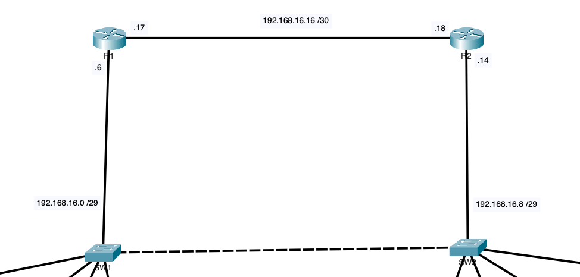
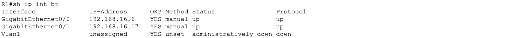
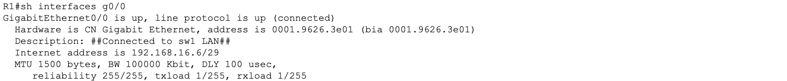
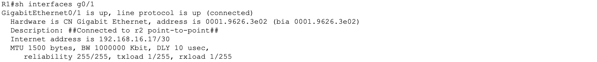
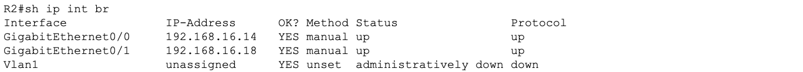
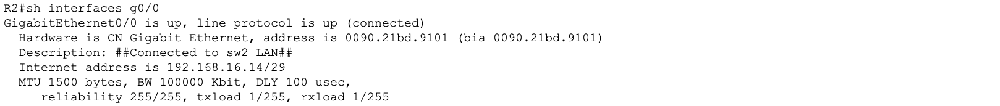
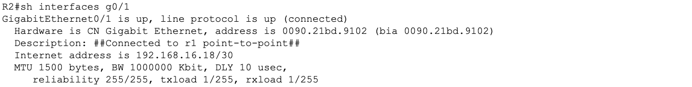
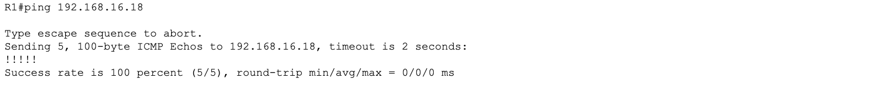
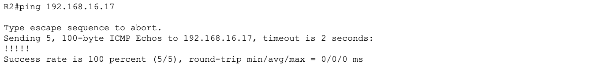

# Lab 05 - Router Interface Configuration

## Objective

Configure and verify all physical interfaces on R1 and R2, establish point-to-point connectivity between the two routers, add interface descriptions for documentation purposes, and verify full interface status across both routers. This lab completes the physical layer foundation before routing protocols and services are introduced in later labs.

## Devices Configured

| Device | Type | Role |
|---|---|---|
| R1 | Cisco ISR 4331 | Gateway router for SW1 LAN |
| R2 | Cisco ISR 4331 | Gateway router for SW2 LAN |

## Topology

R1 connects to SW1 via G0/0 and to R2 via G0/1. R2 connects to SW2 via G0/0 and to R1 via G0/1. The G0/1 interfaces on both routers form the point-to-point link.



## Addressing

| Device | Interface | IP Address | Subnet Mask | Connected To |
|---|---|---|---|---|
| R1 | G0/0 | 192.168.16.6 | 255.255.255.248 | SW1 |
| R1 | G0/1 | 192.168.16.17 | 255.255.255.252 | R2 G0/1 |
| R2 | G0/0 | 192.168.16.14 | 255.255.255.248 | SW2 |
| R2 | G0/1 | 192.168.16.18 | 255.255.255.252 | R1 G0/1 |

## Tools Used

- Cisco Packet Tracer
- Cisco IOS CLI

---

## Why 192.168.16.16/30 for the Point-to-Point Link

This subnet choice was deliberate and reflects real-world network design best practice. Here is the full reasoning:

### The math behind /30

A /30 subnet mask (255.255.255.252) uses 30 bits for the network and leaves 2 bits for hosts.

```
2^2 = 4 total addresses
4 - 2 (network and broadcast) = 2 usable host addresses
```

For a point-to-point link between exactly two routers, 2 usable addresses is the perfect fit. No addresses are wasted.

### Why not use a larger subnet?

Consider what happens if you used a /24 on this link:

```
/24 = 254 usable host addresses
Used = 2 (one per router interface)
Wasted = 252 addresses sitting idle
```

In a small lab this seems harmless. In a real enterprise network with hundreds of point-to-point links, wasting 252 addresses per link adds up fast and exhausts your IP address space unnecessarily.

### The /30 address breakdown for 192.168.16.16/30

| Address | Value | Role |
|---|---|---|
| 192.168.16.16 | Network address | Not assignable |
| 192.168.16.17 | First usable host | Assigned to R1 G0/1 |
| 192.168.16.18 | Second usable host | Assigned to R2 G0/1 |
| 192.168.16.19 | Broadcast address | Not assignable |

Every address in this subnet is accounted for. Nothing is wasted. This is why /30 is the standard subnet mask used on point-to-point router links in professional network design and is what you will see on real enterprise networks and in CCNA exam scenarios.

### Why not /31?

A /31 gives exactly 2 addresses with no network or broadcast address, which technically works on point-to-point links per RFC 3021. However /30 is more widely supported across all IOS versions and is the standard expected on the CCNA exam. /31 is used in some service provider environments but /30 is the safe and universally accepted choice.

---

## Configuration Steps

---

### Step 1 - R1 Interface Configuration

#### G0/0 - LAN Interface Connected to SW1

```
enable
configure terminal
interface GigabitEthernet0/0
 description Connected to SW1 LAN
 ip address 192.168.16.6 255.255.255.248
 no shutdown
exit
```

#### G0/1 - Point-to-Point Interface Connected to R2

```
interface GigabitEthernet0/1
 description Connected to R2 Point-to-Point
 ip address 192.168.16.17 255.255.255.252
 no shutdown
exit
```

| Command | Purpose |
|---|---|
| `description` | Documents what is connected to this interface |
| `ip address` | Assigns the IP address and subnet mask |
| `no shutdown` | Router interfaces are administratively down by default, this brings them up |

**Why are router interfaces down by default?**
Unlike switch ports which come up automatically when a cable is connected, router interfaces are administratively shut down from the factory. This is a security design decision: interfaces must be explicitly enabled by an administrator before they pass any traffic.

**Verify R1:**

```
show ip interface brief
show interfaces GigabitEthernet0/0
show interfaces GigabitEthernet0/1
```







---

### Step 2 - R2 Interface Configuration

#### G0/0 - LAN Interface Connected to SW2

```
enable
configure terminal
interface GigabitEthernet0/0
 description Connected to SW2 LAN
 ip address 192.168.16.14 255.255.255.248
 no shutdown
exit
```

#### G0/1 - Point-to-Point Interface Connected to R1

```
interface GigabitEthernet0/1
 description Connected to R1 Point-to-Point
 ip address 192.168.16.18 255.255.255.252
 no shutdown
exit
```

**Verify R2:**

```
show ip interface brief
show interfaces GigabitEthernet0/0
show interfaces GigabitEthernet0/1
```







---

### Save Configuration on Both Routers

```
end
copy running-config startup-config
```

---

## Verification and Connectivity Testing

### Interface Status Reference

When reading show ip interface brief the Status and Protocol columns tell you everything:

| Status | Protocol | Meaning |
|---|---|---|
| up | up | Interface is fully operational |
| up | down | Physical connection is good but Layer 2 has a problem |
| down | down | No physical connection or cable issue |
| administratively down | down | Interface has been manually shut down with the shutdown command |

All interfaces on R1 and R2 should show up/up after configuration.

---

### Point-to-Point Connectivity Test

**From R1 ping R2 G0/1:**

```
ping 192.168.16.18
```



**From R2 ping R1 G0/1:**

```
ping 192.168.16.17
```



A successful ping confirms:
- Both G0/1 interfaces are up/up
- IP addresses are correctly configured on both ends
- The /30 subnet is correctly applied and both addresses are in the same network
- The physical cable between R1 and R2 is good

---

### Interface Description Verification

Descriptions are visible in show interfaces and show running-config. They serve as inline documentation so any engineer looking at the device knows exactly what is connected to each port without needing a separate network diagram.

```
show running-config | include description
```

Expected output on R1:

```
 description Connected to SW1 LAN
 description Connected to R2 Point-to-Point
```

Expected output on R2:

```
 description Connected to SW2 LAN
 description Connected to R1 Point-to-Point
```

---

### What command removes an IP address from an interface?

If you need to remove or correct an IP address:

```
interface GigabitEthernet0/0
 no ip address 192.168.16.6 255.255.255.248
```

Then reassign the correct address:

```
 ip address [correct-ip] [correct-mask]
```

---

## Key Concepts

**Why are interface descriptions important in a real network?**
In a production network with dozens or hundreds of interfaces, descriptions are the difference between spending 30 seconds or 30 minutes figuring out what is connected where. They are also critical during incidents when you need to identify affected links quickly. Every professional network engineer adds descriptions to every interface as a standard practice.

**What does up/up mean vs down/down vs administratively down?**

| State | Cause | Fix |
|---|---|---|
| up/up | Normal operation | None needed |
| down/down | No cable, bad cable, or wrong port | Check physical connection |
| administratively down | shutdown command was applied | Run no shutdown |
| up/down | Layer 2 mismatch or encapsulation issue | Check duplex, speed, encapsulation settings |

**Why is /30 the standard for point-to-point links?**
It provides exactly 2 usable host addresses which is exactly what two router interfaces need. No addresses are wasted and the subnet boundary is clearly defined. It is the most efficient use of IP address space for a two-endpoint connection.

---

## Lessons Learned

- Router interfaces are administratively down by default and must be explicitly enabled with no shutdown
- Always add interface descriptions before moving on as they are easy to forget and painful to add retroactively across a large network
- /30 is the correct and most efficient subnet for any point-to-point router link
- Using a larger subnet like /24 on a point-to-point link wastes addresses and is considered poor network design
- The show ip interface brief command is the fastest way to get a health check on all interfaces at once
- up/up means fully operational with anything else requiring investigation before moving forward
- Always ping across a point-to-point link immediately after configuration to confirm connectivity before building routing protocols on top of it
