# Lab 06 - Router on a Stick Inter-VLAN Routing

## Objective

Configure router on a stick on R1 to enable inter-VLAN routing between VLAN 10 and VLAN 20 across both switches. This lab introduces Layer 3 routing into the topology for the first time, allowing PCs in different VLANs to communicate through R1 subinterfaces. It also documents the subnet redesign required to make router on a stick work correctly and the topology change made to simplify the network.

## Devices Configured

| Device | Type | Role |
|---|---|---|
| R1 | Cisco ISR 4331 | Router on a stick, single routing point for all VLANs |
| R2 | Cisco ISR 4331 | Point-to-point connection to R1 only, no SW2 connection |
| SW1 | Cisco 2960 | Access layer switch, trunk to R1 and SW2 |
| SW2 | Cisco 2960 | Access layer switch, trunk to SW1 only |

## Topology Change from Previous Labs

To simplify the topology and match the classic single router on a stick design R2 was disconnected from SW2. R2 now only connects to R1 via the point-to-point G0/1 link.

SW2 PCs reach R1 for routing through the trunk link between SW2 and SW1. No direct connection between R1 and SW2 is needed. The trunk does all the Layer 2 forwarding and R1 handles all the Layer 3 routing.

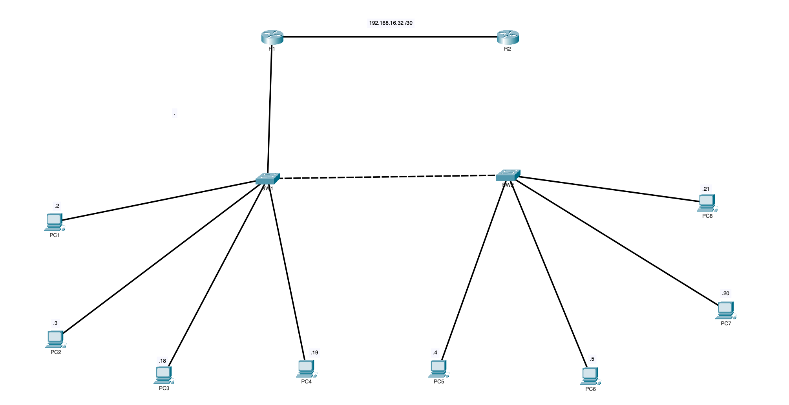

## Subnet Design

Each VLAN requires its own dedicated subnet. A subnet is tied to a router interface not to a physical switch. PCs must be in the subnet of their VLAN gateway regardless of which switch they are physically connected to.

| Subnet | Mask | Purpose | Gateway |
|---|---|---|---|
| 192.168.16.0/28 | 255.255.255.240 | VLAN 10 all PCs both switches | R1 G0/0.10 = 192.168.16.1 |
| 192.168.16.16/28 | 255.255.255.240 | VLAN 20 all PCs both switches | R1 G0/0.20 = 192.168.16.17 |
| 192.168.16.32/30 | 255.255.255.252 | Point-to-point R1 to R2 | R1 G0/1 = 192.168.16.33 |
| 192.168.16.48/28 | 255.255.255.240 | VLAN 99 management | R1 G0/0.99 = 192.168.16.49 |

### Why /28 for each VLAN subnet

A /28 gives 14 usable host addresses which is enough to accommodate multiple PCs, the gateway subinterface, and room for growth. Earlier attempts using /29 (6 usable addresses) did not provide enough space for two VLAN gateways plus PCs on the same subnet.

## Full Address Assignment

### Router Interfaces

| Device | Interface | IP Address | Subnet Mask | Purpose |
|---|---|---|---|---|
| R1 | G0/0 | unassigned | N/A | Physical trunk carrier |
| R1 | G0/0.10 | 192.168.16.1 | 255.255.255.240 | VLAN 10 gateway |
| R1 | G0/0.20 | 192.168.16.17 | 255.255.255.240 | VLAN 20 gateway |
| R1 | G0/0.99 | 192.168.16.49 | 255.255.255.240 | VLAN 99 management gateway |
| R1 | G0/0.100 | unassigned | N/A | Native VLAN 100 |
| R1 | G0/1 | 192.168.16.33 | 255.255.255.252 | Point-to-point to R2 |
| R2 | G0/1 | 192.168.16.34 | 255.255.255.252 | Point-to-point to R1 |

### PC Addressing

**SW1 PCs:**

| PC | VLAN | IP Address | Subnet Mask | Default Gateway |
|---|---|---|---|---|
| PC1 | 10 | 192.168.16.2 | 255.255.255.240 | 192.168.16.1 |
| PC2 | 10 | 192.168.16.3 | 255.255.255.240 | 192.168.16.1 |
| PC3 | 20 | 192.168.16.18 | 255.255.255.240 | 192.168.16.17 |
| PC4 | 20 | 192.168.16.19 | 255.255.255.240 | 192.168.16.17 |

**SW2 PCs:**

| PC | VLAN | IP Address | Subnet Mask | Default Gateway |
|---|---|---|---|---|
| PC5 | 10 | 192.168.16.4 | 255.255.255.240 | 192.168.16.1 |
| PC6 | 10 | 192.168.16.5 | 255.255.255.240 | 192.168.16.1 |
| PC7 | 20 | 192.168.16.20 | 255.255.255.240 | 192.168.16.17 |
| PC8 | 20 | 192.168.16.21 | 255.255.255.240 | 192.168.16.17 |

### Switch SVIs

| Device | Interface | IP Address | Subnet Mask | Default Gateway |
|---|---|---|---|---|
| SW1 | Vlan99 | 192.168.16.50 | 255.255.255.240 | 192.168.16.49 |
| SW2 | Vlan99 | 192.168.16.51 | 255.255.255.240 | 192.168.16.49 |

## Tools Used

- Cisco Packet Tracer
- Cisco IOS CLI

---

## Configuration Steps

---

### Step 1 - Update Point-to-Point Addresses

**On R1:**

```
configure terminal
interface GigabitEthernet0/1
 no ip address
 ip address 192.168.16.33 255.255.255.252
 no shutdown
exit
```

**On R2:**

```
configure terminal
interface GigabitEthernet0/1
 no ip address
 ip address 192.168.16.34 255.255.255.252
 no shutdown
exit
copy running-config startup-config
```


### Step 2 - Create Subinterfaces on R1

```
interface GigabitEthernet0/0.10
 encapsulation dot1Q 10
 ip address 192.168.16.1 255.255.255.240
 description Gateway for VLAN 10 SALES
exit

interface GigabitEthernet0/0.20
 encapsulation dot1Q 20
 ip address 192.168.16.17 255.255.255.240
 description Gateway for VLAN 20 HR
exit

interface GigabitEthernet0/0.99
 encapsulation dot1Q 99
 ip address 192.168.16.49 255.255.255.240
 description Gateway for VLAN 99 MANAGEMENT
exit

interface GigabitEthernet0/0.100
 encapsulation dot1Q 100 native
 description Native VLAN 100
exit
```

**What each command does:**

| Command | Purpose |
|---|---|
| `interface GigabitEthernet0/0.10` | Creates a logical subinterface on the physical G0/0 interface |
| `encapsulation dot1Q 10` | Tags all traffic on this subinterface with VLAN 10 |
| `ip address` | Assigns the gateway IP for that VLAN |
| `encapsulation dot1Q 100 native` | Identifies untagged frames as belonging to VLAN 100 |

**Does the physical interface need an IP address?**
No. The physical G0/0 interface acts as a trunk carrier only. All IP addressing lives on the subinterfaces. The physical interface just needs to be up with no shutdown.

**What is router on a stick and why is it a limitation in large networks?**
Router on a stick uses a single physical interface divided into logical subinterfaces to route between VLANs. All inter-VLAN traffic must pass through one physical link. As VLAN count and traffic volume grow this single link becomes a bottleneck. Enterprise networks replace router on a stick with a Layer 3 switch which performs inter-VLAN routing in dedicated hardware at much higher speeds.

**Save R1:**

```
end
copy running-config startup-config
```

---

### Step 3 - Update SW1 SVI and Default Gateway

```
enable
configure terminal
interface vlan 99
 no ip address
 ip address 192.168.16.50 255.255.255.240
 no shutdown
exit
no ip default-gateway 192.168.16.6
ip default-gateway 192.168.16.49
exit
copy running-config startup-config
```

---

### Step 4 - Update SW2 SVI and Default Gateway

```
enable
configure terminal
interface vlan 99
 no ip address
 ip address 192.168.16.51 255.255.255.240
 no shutdown
exit
no ip default-gateway 192.168.16.14
ip default-gateway 192.168.16.49
exit
copy running-config startup-config
```

---

## Verification

### R1 Interface Status

```
show ip interface brief
```

Expected output:

```
GigabitEthernet0/0         unassigned     up   up
GigabitEthernet0/0.10      192.168.16.1   up   up
GigabitEthernet0/0.20      192.168.16.17  up   up
GigabitEthernet0/0.99      192.168.16.49  up   up
GigabitEthernet0/0.100     unassigned     up   up
GigabitEthernet0/1         192.168.16.33  up   up
```

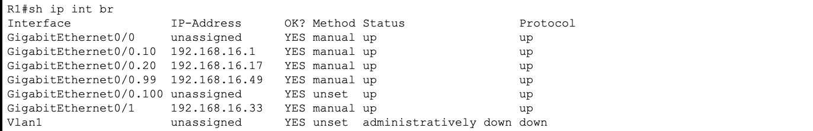

---

### R1 Subinterface Detail

```
show interfaces GigabitEthernet0/0.10
show interfaces GigabitEthernet0/0.20
show interfaces GigabitEthernet0/0.99
```

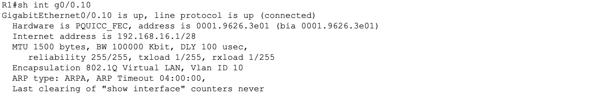

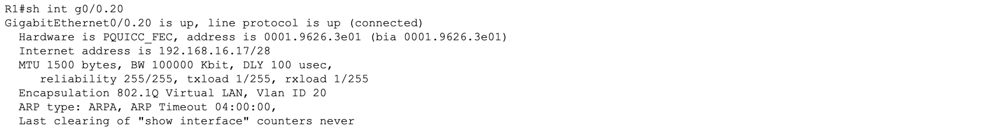

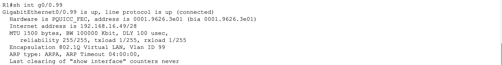

---

### R1 Routing Table

```
show ip route
```

Expected connected routes:

```
C    192.168.16.0/28  is directly connected GigabitEthernet0/0.10
C    192.168.16.16/28 is directly connected GigabitEthernet0/0.20
C    192.168.16.32/30 is directly connected GigabitEthernet0/1
C    192.168.16.48/28 is directly connected GigabitEthernet0/0.99
```

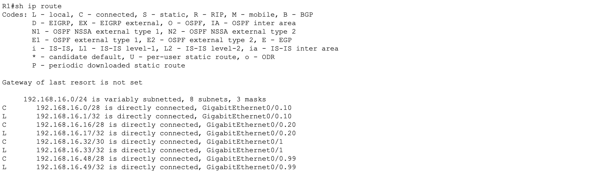

---

## Connectivity Tests

All eight tests were run from PC1 command prompt. Tests 3 and 4 are the milestone results for this lab -- the first time inter-VLAN routing succeeded.

### Test Results Summary

| Test | From | To | IP | Result | What it proves |
|---|---|---|---|---|---|
| 1 | PC1 | PC2 | 192.168.16.3 | Pass | Same VLAN same switch Layer 2 forwarding |
| 2 | PC1 | PC5 | 192.168.16.4 | Pass | Same VLAN different switch trunk forwarding |
| 3 | PC1 | PC3 | 192.168.16.18 | Pass | Inter-VLAN routing through R1 same switch |
| 4 | PC1 | PC7 | 192.168.16.20 | Pass | Inter-VLAN routing through R1 different switch |
| 5 | PC1 | R1 VLAN 10 | 192.168.16.1 | Pass | PC can reach its default gateway |
| 6 | PC1 | R1 VLAN 20 | 192.168.16.17 | Pass | PC can reach R1 VLAN 20 subinterface |
| 7 | PC1 | R1 G0/1 | 192.168.16.33 | Pass | PC can reach R1 point-to-point interface |
| 8 | PC1 | R2 G0/1 | 192.168.16.34 | Fail | Expected, R2 has no return route until OSPF in Lab 08 |

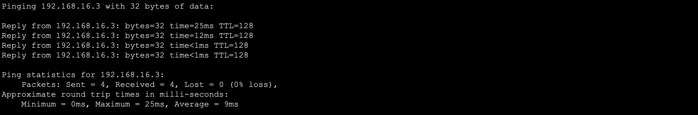

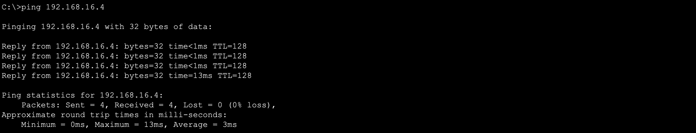

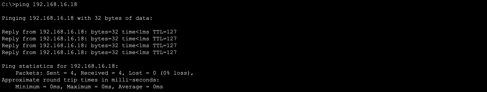

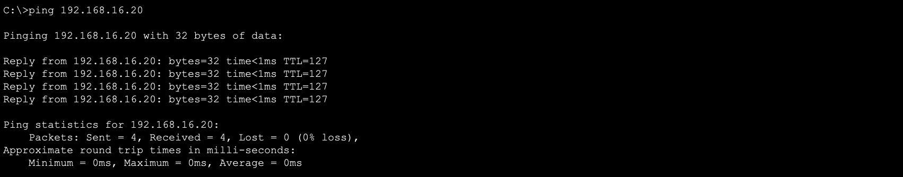

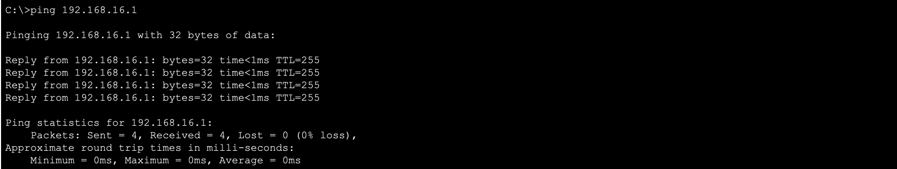

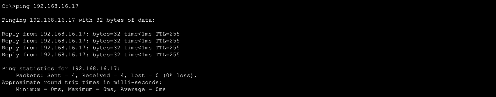


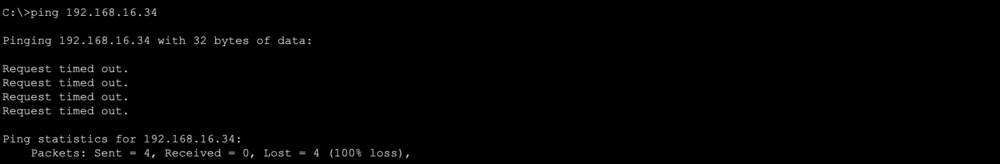

---

## How Inter-VLAN Routing Works in This Topology

### PC1 to PC3 packet path (different VLAN same switch)

```
PC1 (VLAN 10, 192.168.16.2)
  > SW1 Fa0/1 (access port VLAN 10)
  > SW1 Fa0/5 (trunk to R1, frame tagged VLAN 10)
  > R1 G0/0.10 (receives frame, strips tag, routes to VLAN 20 subnet)
  > R1 G0/0.20 (sends frame tagged VLAN 20)
  > SW1 Fa0/5 (trunk from R1, frame tagged VLAN 20)
  > SW1 Fa0/3 (access port VLAN 20)
  > PC3 (VLAN 20, 192.168.16.18)
```

### PC1 to PC7 packet path (different VLAN different switch)

```
PC1 (VLAN 10, 192.168.16.2)
  > SW1 > R1 (routed from VLAN 10 to VLAN 20)
  > SW1 Fa0/6 (trunk to SW2, frame tagged VLAN 20)
  > SW2 Fa0/7 (access port VLAN 20)
  > PC7 (VLAN 20, 192.168.16.20)
```

### PC1 to PC5 packet path (same VLAN different switch, no routing)

```
PC1 (VLAN 10, 192.168.16.2)
  > SW1 Fa0/6 (trunk to SW2, frame tagged VLAN 10)
  > SW2 Fa0/5 (access port VLAN 10)
  > PC5 (VLAN 10, 192.168.16.4)
```

Note: Same VLAN traffic never goes to R1. It is switched directly at Layer 2 through the trunk. Routing only happens when traffic crosses VLAN boundaries.

---

## Key Concepts

**What is router on a stick?**
A method of inter-VLAN routing using a single physical router interface divided into logical subinterfaces. Each subinterface handles one VLAN and acts as the default gateway for all PCs in that VLAN.

**Does the physical interface need an IP?**
No. The physical interface is just a trunk carrier. Only the subinterfaces need IP addresses.

**What is the native VLAN subinterface for?**
It identifies untagged frames arriving on the trunk as belonging to VLAN 100. No IP address is needed because VLAN 100 carries no user or management traffic in this topology.

**Why does same VLAN traffic not go through R1?**
PCs in the same VLAN are in the same subnet and the same Layer 2 broadcast domain. Switches forward same-VLAN traffic directly using MAC address tables without involving a router. Routing only occurs when traffic must cross a subnet boundary.

**What happens when PC1 pings R2 G0/1?**
The packet reaches R2 successfully because R1 has a connected route to 192.168.16.32/30. However R2 has no route back to 192.168.16.0/28 where PC1 lives so the reply is dropped. This will be resolved when OSPF is configured in Lab 08.

---

## Lessons Learned

**Subnet redesign was required to make router on a stick work:**
The original topology used /29 subnets with only 6 usable addresses each. This was not enough space to accommodate VLAN gateways, physical router interfaces, and PC addresses without conflicts. The subnets were redesigned to /28 giving 14 usable addresses per subnet with room for growth.

**Each subinterface must be in a unique subnet:**
IOS will reject an IP address on a subinterface if it overlaps with any other interface on the same router. This means each VLAN must have its own dedicated subnet. Two subinterfaces cannot share addresses from the same network.

**PCs must be in the subnet of their VLAN gateway regardless of which switch they are connected to:**
This was the most important lesson of this lab. A PC's IP address is determined by its VLAN not by which physical switch it is connected to. PC3 is in VLAN 20 so it must have an address in the VLAN 20 subnet 192.168.16.16/28 even though it is physically connected to SW1. Assigning a PC an address from the wrong subnet makes its default gateway unreachable and breaks all routing.

**The topology was simplified by removing R2 from SW2:**
The original design had R2 connected to SW2 which required two separate router on a stick configurations and complex subnet planning. By disconnecting R2 from SW2 and routing all PC traffic through R1 via the trunk between SW1 and SW2, the design became a classic single router on a stick topology that is simpler, easier to troubleshoot, and matches the standard CCNA exam scenario.

**The trunk between SW1 and SW2 extends VLANs across both switches:**
Because the trunk carries VLAN 10 and VLAN 20 between switches, PCs in the same VLAN on different switches are in the same broadcast domain and the same subnet. SW2 PCs reach R1 for routing by sending traffic through the trunk to SW1 and then up to R1. No direct cable between R1 and SW2 is needed.

**A failed ping is not always a misconfiguration:**
PC1 failing to ping R2 G0/1 is expected and correct at this stage. R2 has no return route to the PC subnets yet. This will be resolved when OSPF advertises all routes between R1 and R2 in Lab 08. Understanding why a ping fails is just as important as making it succeed.
