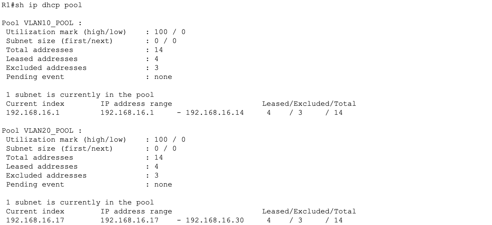
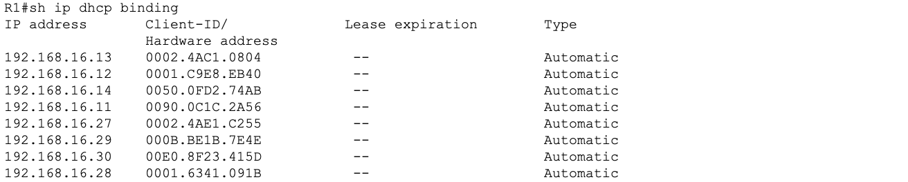
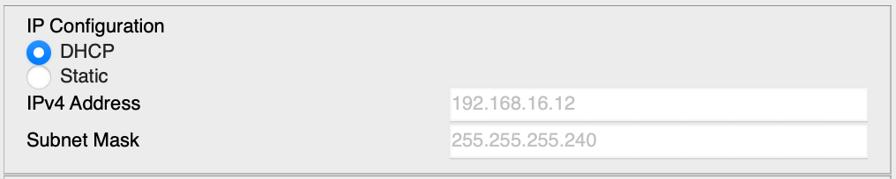
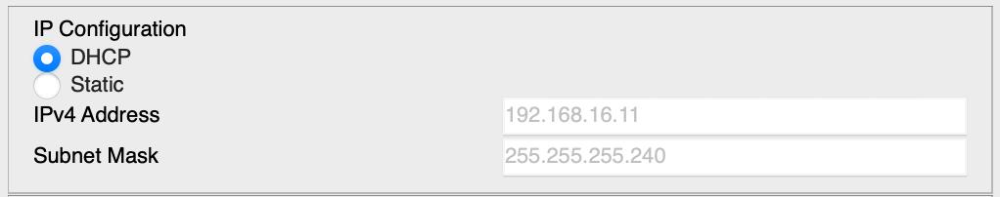
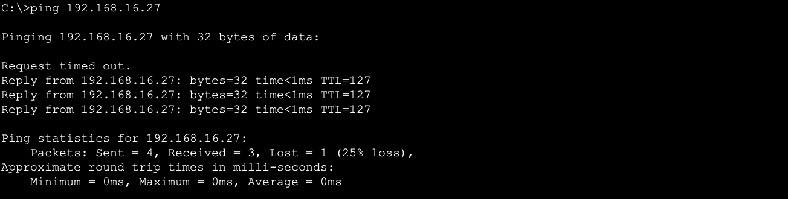
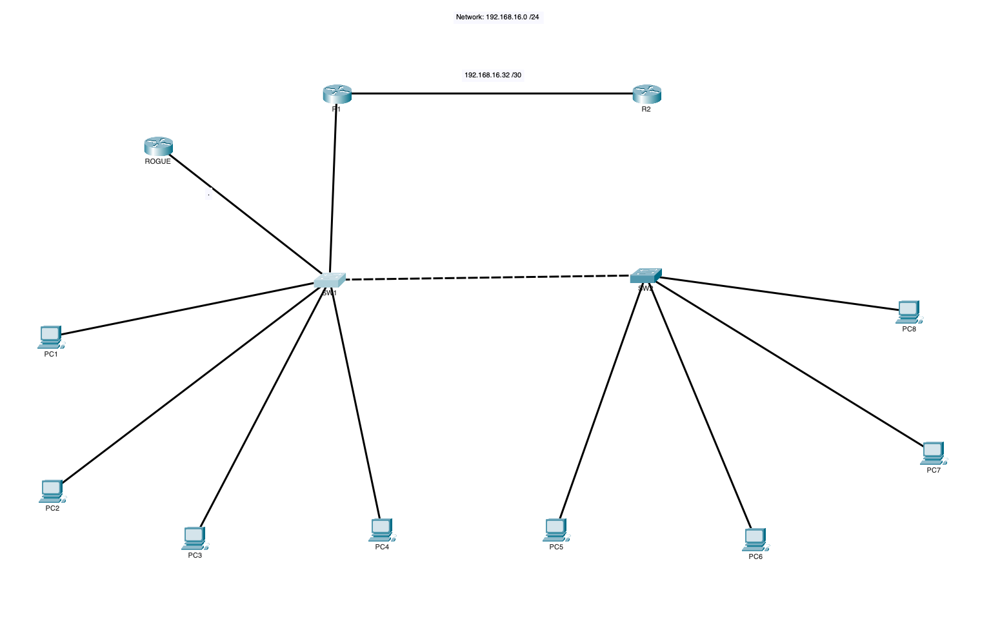
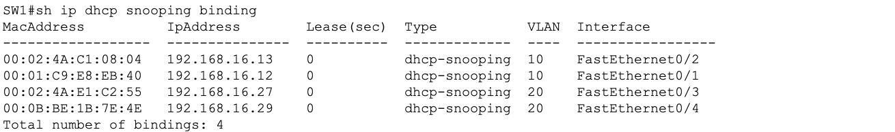
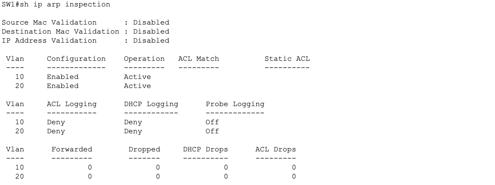
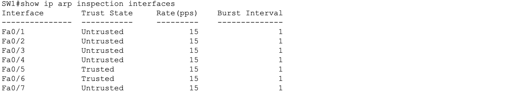

# Lab 07 - DHCP Server, DHCP Snooping Simulation, and DAI Verification

## Objective

Configure R1 as the DHCP server for all VLANs across both switches, verify all PCs receive dynamic addresses, simulate a rogue DHCP server attack to prove DHCP snooping is blocking it, and verify Dynamic ARP Inspection is correctly configured and protecting the network. This lab also documents the known limitations of Packet Tracer when simulating Layer 2 security features.

## Devices Configured

| Device | Type | Role |
|---|---|---|
| R1 | Cisco ISR 4331 | DHCP server for VLAN 10 and VLAN 20 |
| SW1 | Cisco 2960 | DHCP snooping enforcement, DAI enforcement |
| SW2 | Cisco 2960 | DHCP snooping enforcement, DAI enforcement |

## Topology

No topology changes in this lab. R1 serves DHCP to all PCs on both switches through the existing router on a stick configuration. SW2 PCs receive their DHCP addresses through the trunk to SW1 and up to R1.


## Tools Used

- Cisco Packet Tracer
- Cisco IOS CLI
- Packet Tracer Simulation Mode

---

## Why DHCP Matters in Larger Networks

In a small lab with 8 PCs manually assigning IP addresses is manageable. In a real enterprise network with hundreds or thousands of devices manual assignment becomes impossible to maintain and error prone.

DHCP solves this by centralizing IP address management on a single server. When a new device connects to the network it automatically receives an IP address, subnet mask, default gateway, and DNS server without any manual configuration. When the device disconnects its address is returned to the pool and made available for another device.

The real operational benefits in larger networks include:

- Zero touch provisioning for new devices joining the network
- Centralized visibility of every IP to MAC mapping across the entire network
- Automatic address reclamation when devices leave preventing address exhaustion
- Consistent gateway and DNS assignment across all clients eliminating misconfiguration
- Simplified troubleshooting through the binding table which maps every IP to a specific MAC and switch port

Without DHCP a network administrator in a large enterprise would spend significant time manually tracking, assigning, and reclaiming IP addresses which can be a process that does not scale and introduces human error.

---

## DHCP Pool Design

| Pool | Subnet | Mask | Gateway | DNS | Excluded Range |
|---|---|---|---|---|---|
| VLAN10_POOL | 192.168.16.0 | 255.255.255.240 | 192.168.16.1 | 8.8.8.8 | .1 through .10 |
| VLAN20_POOL | 192.168.16.16 | 255.255.255.240 | 192.168.16.17 | 8.8.8.8 | .17 through .26 |

Excluding the first 10 addresses in each pool reserves space for gateways, SVIs, router interfaces, and any future static assignments without risking conflicts with dynamically assigned addresses.

---

## Configuration Steps

---

### Step 1 - Configure Excluded Addresses on R1

```
enable
configure terminal
ip dhcp excluded-address 192.168.16.1 192.168.16.10
ip dhcp excluded-address 192.168.16.17 192.168.16.26
```

| Command | Purpose |
|---|---|
| `ip dhcp excluded-address` | Reserves a range of addresses DHCP will never assign to clients |

Excluded ranges protect:

| Address | Device |
|---|---|
| 192.168.16.1 | R1 G0/0.10 VLAN 10 gateway |
| 192.168.16.2 through .10 | Reserved for future static assignments |
| 192.168.16.17 | R1 G0/0.20 VLAN 20 gateway |
| 192.168.16.18 through .26 | Reserved for future static assignments |

**Why exclude addresses before creating pools?**
The exclusion must be configured before the pool or DHCP may hand out a reserved address to a client before the exclusion takes effect. Always exclude first then create pools.

---

### Step 2 - Create DHCP Pool for VLAN 10

```
ip dhcp pool VLAN10_POOL
 network 192.168.16.0 255.255.255.240
 default-router 192.168.16.1
 dns-server 8.8.8.8
exit
```

| Command | Purpose |
|---|---|
| `ip dhcp pool VLAN10_POOL` | Creates and names the pool |
| `network 192.168.16.0 255.255.255.240` | Defines the subnet this pool serves |
| `default-router 192.168.16.1` | Tells clients to use R1 G0/0.10 as their gateway |
| `dns-server 8.8.8.8` | Assigns Google DNS to all VLAN 10 clients |

---

### Step 3 - Create DHCP Pool for VLAN 20

```
ip dhcp pool VLAN20_POOL
 network 192.168.16.16 255.255.255.240
 default-router 192.168.16.17
 dns-server 8.8.8.8
exit
```

**Save R1:**

```
end
copy running-config startup-config
```

---

### Step 4 - Set All PCs to DHCP Mode

Click each PC in Packet Tracer, go to Desktop, IP Configuration and select the DHCP radio button. All 8 PCs should receive addresses within a few seconds.

**Expected address ranges after DHCP assignment:**

| VLAN | Pool | First available address | Last available address |
|---|---|---|---|
| VLAN 10 | VLAN10_POOL | 192.168.16.11 | 192.168.16.14 |
| VLAN 20 | VLAN20_POOL | 192.168.16.27 | 192.168.16.30 |

---

## Verification

### DHCP Pool and Binding Verification on R1

```
show ip dhcp pool
show ip dhcp binding
```

**What each command shows:**

| Command | Purpose |
|---|---|
| `show ip dhcp pool` | Pool name, subnet, gateway, and available address count |
| `show ip dhcp binding` | IP address, MAC address, lease expiry, and type for every client |





---

### PC DHCP Address Verification

All four screenshots below confirm PCs on both switches and both VLANs received addresses from R1.






---

### Connectivity Verification After DHCP

Inter-VLAN routing confirmed working with dynamically assigned addresses.

```
PC1> ping [PC3 DHCP address]
```



---

## DHCP Snooping Simulation

### What DHCP Snooping Protects Against

DHCP snooping prevents rogue DHCP server attacks. In an unsecured network any device can be configured as a DHCP server and start responding to client Discover messages with fake offers. A successful rogue DHCP attack can redirect all client traffic through an attacker's machine by handing out a malicious default gateway -- a classic man-in-the-middle setup.

DHCP snooping prevents this by classifying every switch port as trusted or untrusted. Only trusted ports are allowed to forward DHCP server responses. Untrusted ports can send client messages but any server response arriving on an untrusted port is dropped immediately before it reaches any client.

In a larger network this is critical because a single rogue DHCP server can redirect traffic for hundreds of clients simultaneously. DHCP snooping stops the attack at the switch port level before any client is affected.

---

### Simulation Steps

**Step 1 - Prepare an unused port on SW1 for the rogue router**

```
configure terminal
interface Fa0/7
 switchport mode access
 switchport access vlan 10
exit
```

**Step 2 - Connect and configure the rogue router**

A temporary router was added to the canvas and connected to SW1 Fa0/7. The rogue router was configured as a DHCP server attempting to hand out addresses in the VLAN 10 subnet:

```
enable
configure terminal
hostname ROGUE
interface GigabitEthernet0/0
 ip address 192.168.16.6 255.255.255.240
 no shutdown
exit
ip dhcp pool ROGUE-POOL
 network 192.168.16.0 255.255.255.240
 default-router 192.168.16.6
 dns-server 8.8.8.8
exit
```



**Step 3 - Trigger a DHCP request from PC1**

PC1 was set back to static then immediately back to DHCP to force a new Discover message. In simulation mode with DHCP filter active the following sequence was observed:

- PC1 sent a DHCP Discover broadcast
- Both R1 and the rogue router received the Discover
- R1 sent a legitimate DHCP Offer through the trusted uplink on Fa0/5
- The rogue router sent a fake DHCP Offer through Fa0/7 which is untrusted
- SW1 dropped the rogue DHCP Offer at Fa0/7 before it reached PC1
- PC1 received only R1's legitimate offer and kept its original address

**Step 4 - Verify the binding table confirms legitimate lease**

```
show ip dhcp snooping binding
```

PC1 retained its R1 assigned address confirming the rogue offer was blocked.




**Step 5 - Clean up**

The rogue router was removed from the canvas. Fa0/7 was reset:

```
configure terminal
interface Fa0/7
 no switchport access vlan 10
 switchport access vlan 1
exit
```

---

## DAI Verification

### What DAI Protects Against

Dynamic ARP Inspection prevents ARP spoofing attacks. ARP has no authentication: any device can send a gratuitous ARP claiming to own any IP address. An attacker exploits this by broadcasting fake ARP replies that map their MAC address to a legitimate IP such as the default gateway. Once clients update their ARP tables with the fake mapping all their traffic is redirected through the attacker's device.

DAI stops this by intercepting every ARP packet on untrusted ports and validating the IP to MAC mapping against the DHCP snooping binding table. If the ARP claim does not match the binding table record the packet is dropped before it can poison any client's ARP cache.

### Why DHCP Snooping Must Be Configured Before DAI

DAI has no independent database of valid IP to MAC mappings. It relies entirely on the DHCP snooping binding table for its validation reference. Without a populated binding table DAI cannot distinguish legitimate ARP from spoofed ARP and will drop all ARP on untrusted ports including valid traffic. DHCP snooping must always be configured and its binding table populated before DAI is enabled.

---

### DAI Verification Commands

```
show ip arp inspection
show ip arp inspection interfaces
show ip dhcp snooping binding
```





**Reading the show ip arp inspection interfaces output:**

| Field | What it means |
|---|---|
| Trust State: Trusted | ARP packets on this port are not inspected |
| Trust State: Untrusted | All ARP packets on this port are validated against the binding table |
| Rate: None | No rate limiting configured |

All PC-facing access ports show untrusted. All uplinks and trunk ports show trusted. This is the correct configuration.

---

### Packet Tracer Limitations with DAI

During simulation the show ip arp inspection statistics command did not increment the dropped counter even when spoofed ARP packets were generated. This is a known limitation of Packet Tracer where the software does not fully simulate DAI packet dropping at the statistical level.

## Key Concepts

**What is the default-router command?**
It tells DHCP clients which IP address to use as their default gateway. Without this clients receive an IP address but have no way to reach other networks.

**What does the dns-server command do?**
It tells clients which DNS server to use for name resolution. In this lab 8.8.8.8 (Google DNS) is used as the DNS server for all clients.

**What command verifies DHCP leases?**
`show ip dhcp binding` on R1 shows every active lease including the IP address, MAC address, and lease expiry time.

**What command verifies DHCP pool info?**
`show ip dhcp pool` shows pool name, subnet, total addresses, addresses in use, and addresses available.

**Why exclude addresses before creating pools?**
Exclusions must exist before pools are created. If a pool is created first DHCP may assign a reserved address to a client before the exclusion is applied causing an IP conflict.

**Which ports should be trusted for DHCP snooping?**
Only ports connected to legitimate DHCP servers or uplinks toward the server. In this topology SW1 Fa0/5 (uplink to R1) and Fa0/6 (trunk to SW2) are trusted. All PC-facing access ports are untrusted.

---

## Lessons Learned

- Always configure DHCP excluded addresses before creating pools to prevent reserved addresses from being handed out
- DHCP snooping is most valuable in larger networks where rogue DHCP attacks can affect hundreds of clients simultaneously. A single unsecured port is all an attacker needs
- DAI depends entirely on the DHCP snooping binding table and without it DAI cannot validate ARP and will drop legitimate traffic
- Packet Tracer does not fully simulate DAI dropped packet statistics.
- The DHCP binding table serves double duty as it provides lease visibility for administrators and serves as the validation reference for DAI
- SW2 PCs successfully received DHCP addresses from R1 through the trunk to SW1 without any direct connection between R1 and SW2. This proves the router on a stick and trunk design is working end to end
- Always retest inter-VLAN connectivity after switching from static to DHCP addressing to confirm dynamic addresses do not break existing routing
