# Lab 08 - OSPFv2 Configuration and Default Route Advertisement

## Objective

Configure OSPFv2 on R1 and R2 to enable dynamic routing between all subnets in the topology. Add loopback interfaces on both routers to provide stable Router IDs and simulate remote networks. Advertise a default route from R2 into OSPF so all devices learn a path to simulated internet destinations. This lab represents the first time all subnets in the topology can communicate end to end.

## Devices Configured

| Device | Type | Role |
|---|---|---|
| R1 | Cisco ISR 4331 | OSPF process 1, Router ID 1.1.1.1, advertises all LAN subnets |
| R2 | Cisco ISR 4331 | OSPF process 1, Router ID 2.2.2.2, advertises default route |

## Topology Notes

R2 remains connected only to R1 via the point-to-point G0/1 link. R2 has no LAN connection and no PC subnets to advertise. Its role is to simulate a WAN-facing router providing a default route to the rest of the network. The loopback interface on R2 simulates a remote network reachable through OSPF.


## Tools Used

- Cisco Packet Tracer
- Cisco IOS CLI

---

## What OSPFv2 Fixes in This Topology

Before OSPF R1 only knew about its directly connected subnets and R2 had no visibility of any PC networks. The following connections were failing:

| Test | Before OSPF | After OSPF |
|---|---|---|
| PC1 ping R2 loopback 2.2.2.2 | Fail | Pass |
| PC1 ping R2 G0/1 | Fail | Pass |
| R1 ping R2 loopback | Fail | Pass |
| R2 ping PC subnets | Fail | Pass |
| All devices learn default route | No | Yes |

OSPF solves this by dynamically exchanging routing information between R1 and R2 so both routers build a complete picture of all reachable networks without any static route configuration.

---

## Configuration Steps

---

### Step 1 - Loopback Interfaces

Loopbacks are configured before OSPF so they are immediately available for advertisement when the OSPF process starts.

**On R1:**

```
enable
configure terminal
interface Loopback0
 ip address 1.1.1.1 255.255.255.255
 description R1 Router ID and OSPF stability loopback
exit
```

**On R2:**

```
enable
configure terminal
interface Loopback0
 ip address 2.2.2.2 255.255.255.255
 description R2 Router ID and OSPF stability loopback
exit
```

**What is a loopback interface?**
A loopback is a virtual software interface that exists entirely within the router. It has no physical port and no cable. It is always up as long as the router is powered on and cannot go down due to a cable failure or port issue.

**Why use /32 for loopback addresses?**
A loopback represents a single endpoint, in this case the router itself. A /32 mask means exactly one address with no network address or broadcast. It is the most precise and efficient assignment for an interface that represents a single device.

**Why are loopbacks important for OSPF stability?**
OSPF assigns every router a Router ID which it uses to identify itself to neighbors and build the topology map. If no loopback is configured IOS automatically selects the highest active physical interface IP as the Router ID. If that physical interface goes down the Router ID changes, OSPF tears down its neighbor relationships, and routes are temporarily lost causing a network disruption. A loopback never goes down so it provides a permanent stable Router ID that survives any physical link failure.

**Can a loopback interface go down?**
No. A loopback is always up as long as the router is running. It is the most reliable interface type on a Cisco router.

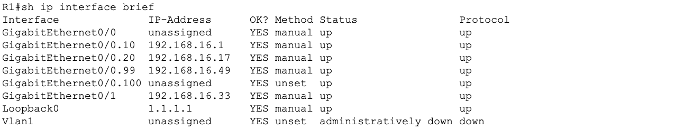

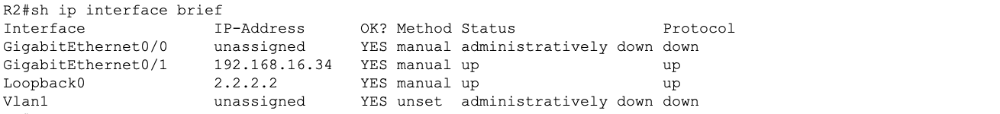

---

### Step 2 - OSPFv2 Configuration on R1

```
configure terminal
router ospf 1
 router-id 1.1.1.1
 network 192.168.16.0 0.0.0.15 area 0
 network 192.168.16.16 0.0.0.15 area 0
 network 192.168.16.32 0.0.0.3 area 0
 network 192.168.16.48 0.0.0.15 area 0
 network 1.1.1.1 0.0.0.0 area 0
 passive-interface GigabitEthernet0/0.10
 passive-interface GigabitEthernet0/0.20
 passive-interface GigabitEthernet0/0.99
 passive-interface GigabitEthernet0/0.100
 passive-interface Loopback0
 auto-cost reference-bandwidth 1000
exit
```

**Command breakdown:**

| Command | Purpose |
|---|---|
| `router ospf 1` | Starts OSPF process 1 on this router |
| `router-id 1.1.1.1` | Manually sets the Router ID to the loopback address |
| `network x.x.x.x wildcard area 0` | Advertises the matching network into OSPF area 0 |
| `passive-interface` | Stops OSPF hellos on interfaces with no OSPF neighbors |
| `auto-cost reference-bandwidth 1000` | Sets reference bandwidth to 1000 Mbps for accurate cost calculation |

**Wildcard mask reference for this topology:**

| Subnet | Prefix | Wildcard |
|---|---|---|
| 192.168.16.0 | /28 | 0.0.0.15 |
| 192.168.16.16 | /28 | 0.0.0.15 |
| 192.168.16.32 | /30 | 0.0.0.3 |
| 192.168.16.48 | /28 | 0.0.0.15 |
| 1.1.1.1 | /32 | 0.0.0.0 |

**Does the OSPF process ID need to match on neighbors?**
No. The process ID is locally significant only. R1 can run process 1 and R2 can run process 2 and they will still form a neighbor relationship. What must match between OSPF neighbors is the area number, hello and dead timers, and the subnet mask on the connecting interface.

**What is a passive interface and which interfaces should be passive?**
A passive interface stops OSPF from sending hello packets out that interface. OSPF still advertises the network connected to that interface into the topology but it just does not try to form neighbors through it. All LAN-facing subinterfaces, the native VLAN subinterface, and the loopback should be passive because there are no OSPF routers on those segments. Only G0/1 connecting to R2 should remain active for neighbor formation.

**Why change the reference bandwidth?**
The default OSPF reference bandwidth is 100 Mbps. Any interface faster than 100 Mbps automatically gets a cost of 1 regardless of actual speed. This means a 100 Mbps link and a 10 Gbps link look identical to OSPF when making path decisions. Setting the reference bandwidth to 1000 Mbps allows OSPF to assign different costs to different speed links and choose better paths in higher speed environments. This setting must match on all routers in the OSPF domain.

---

### Step 3 - OSPFv2 Configuration on R2

```
configure terminal
router ospf 1
 router-id 2.2.2.2
 network 192.168.16.32 0.0.0.3 area 0
 network 2.2.2.2 0.0.0.0 area 0
 passive-interface Loopback0
 auto-cost reference-bandwidth 1000
exit
```

R2 only advertises the point-to-point subnet and its loopback. It has no LAN subnets to advertise since it is not connected to SW2.

**What must match between OSPF neighbors?**

| Parameter | Must match |
|---|---|
| Area number | Yes |
| Hello interval | Yes |
| Dead interval | Yes |
| Subnet and mask on connecting interface | Yes |
| Authentication if configured | Yes |

**What must NOT be the same between OSPF neighbors?**

| Parameter | Must be unique |
|---|---|
| Router ID | Must be different on every router |
| Process ID | Locally significant, does not need to match |

---

### Step 4 - Default Route on R2

```
configure terminal
ip route 0.0.0.0 0.0.0.0 Loopback0
router ospf 1
 default-information originate
exit
```

**What is the default route?**
The default route 0.0.0.0/0 matches any destination. It is the route of last resort. When a router receives a packet destined for a network it has no specific route for, it forwards the packet using the default route. In a real network this points to an internet service provider. In this lab it points to R2's loopback simulating an internet exit point.

**What does default-information originate do?**
It instructs R2 to advertise the default route into the OSPF domain so all other routers receive it automatically. Without this command R1 would never learn the default route through OSPF even though R2 has it configured.

**How does R1 receive the default route from R2?**
Through the OSPF update process. Once R2 advertises it R1 installs it in its routing table as an OSPF external type 2 route. R1 then uses it to forward any traffic destined for unknown networks toward R2.

**What does the default route look like in the routing table?**

```
O*E2 0.0.0.0/0 [110/1] via 192.168.16.34
```

O = learned via OSPF, E2 = external type 2 route, the asterisk marks it as the candidate default route.

---

### Save Both Routers

```
end
copy running-config startup-config
```

---

## Verification

### OSPF Neighbor Verification

```
show ip ospf neighbor
```

**On R1 -- expected output:**

```
Neighbor ID   Pri   State    Dead Time   Address         Interface
2.2.2.2       1     FULL/    00:00:35    192.168.16.34   GigabitEthernet0/1
```

The State column must show FULL. This means the two routers have successfully exchanged their complete link state databases and are fully synchronized. Any state other than FULL indicates a problem.

**OSPF neighbor states in order:**

| State | Meaning |
|---|---|
| Down | No hellos received |
| Init | Hello received but router ID not seen in neighbor's hello |
| 2-Way | Bidirectional communication established |
| Exstart | Master and slave election for database exchange |
| Exchange | Database descriptor packets being exchanged |
| Loading | Link state requests being processed |
| Full | Complete synchronization achieved |

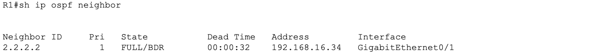

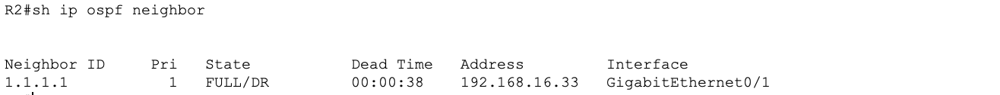

---

### OSPF Interface Verification

```
show ip ospf interface brief
```

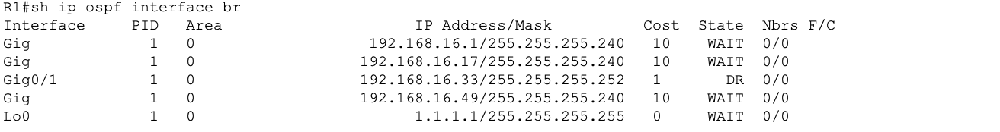

Confirms which interfaces are running OSPF and their area assignments.

---

### OSPF Route Verification

**On R1:**

```
show ip route ospf
```

Expected OSPF learned routes on R1:

```
O    2.2.2.2/32 [110/2] via 192.168.16.34
O*E2 0.0.0.0/0 [110/1] via 192.168.16.34
```

R1 learns R2's loopback and the default route through OSPF.

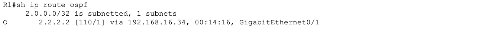

**On R2:**

```
show ip route ospf
```

Expected OSPF learned routes on R2:

```
O    192.168.16.0/28 [110/2] via 192.168.16.33
O    192.168.16.16/28 [110/2] via 192.168.16.33
O    192.168.16.48/28 [110/2] via 192.168.16.33
O    1.1.1.1/32 [110/2] via 192.168.16.33
```

R2 learns all of R1's subnets through OSPF for the first time.

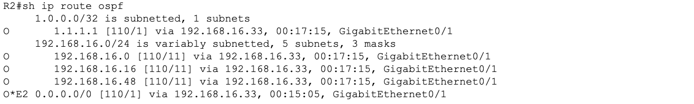

---

### Full Routing Table on R1

```
show ip route
```

The full routing table on R1 shows both connected routes (C) and OSPF learned routes (O and O E2).

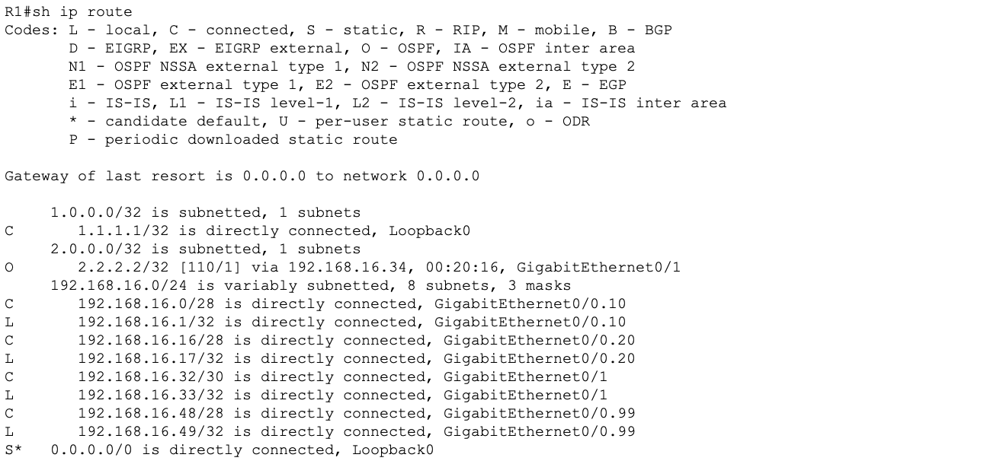

---

### OSPF Protocol Verification

```
show ip protocols
```

Confirms OSPF process ID, Router ID, networks being advertised, passive interfaces, and reference bandwidth.

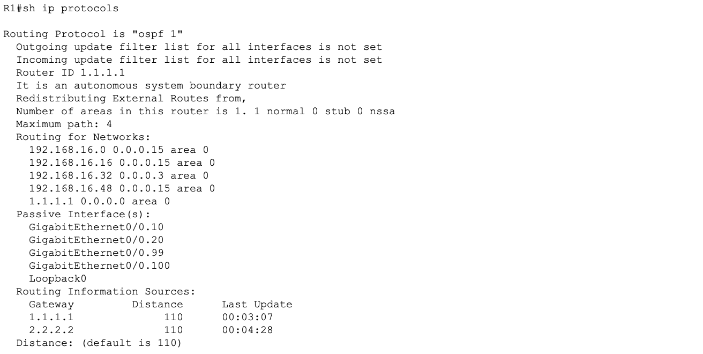

---

## Connectivity Tests

All tests passed after OSPF convergence.

**From PC1:**

```
ping 2.2.2.2
ping 192.168.16.34
```

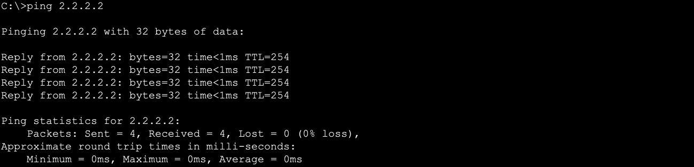

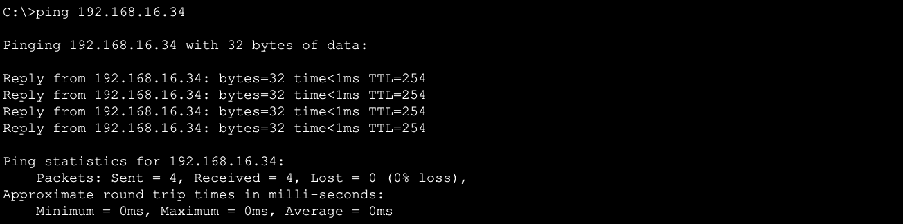

**From R1:**

```
ping 2.2.2.2
```

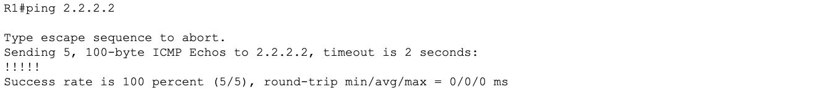

**From R2:**

```
ping 192.168.16.2
```

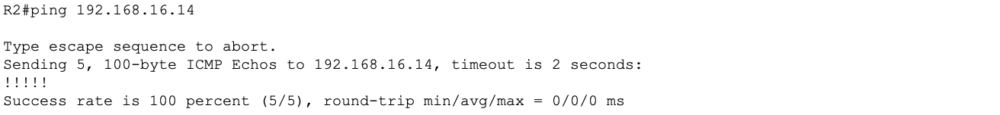

---

## OSPF Cost and Metric Explained

**What is the OSPF cost and how is it calculated?**

OSPF uses cost as its metric to determine the best path between networks. Cost is calculated as:

```
Cost = Reference bandwidth / Interface bandwidth
```

With the default reference bandwidth of 100 Mbps:
- FastEthernet (100 Mbps) = cost 1
- GigabitEthernet (1000 Mbps) = cost 1 (same as FastEthernet, which is wrong)

With our reference bandwidth of 1000 Mbps:
- FastEthernet (100 Mbps) = cost 10
- GigabitEthernet (1000 Mbps) = cost 1

The [110/2] notation in the routing table means:
- 110 = OSPF administrative distance
- 2 = total path cost to reach that network

---

## Key Concepts

**What are all the OSPF neighbor states in order?**
Down, Init, 2-Way, Exstart, Exchange, Loading, Full. Neighbors must reach Full for routes to be exchanged.

**What does the O prefix mean in the routing table?**
O means the route was learned via OSPF. O E2 means it is an OSPF external type 2 route redistributed from outside the OSPF domain.

**What does [110/2] mean in an OSPF route?**
110 is the administrative distance of OSPF. 2 is the total cost to reach the destination network. Lower cost is always preferred.

**How do you fix an OSPF neighbor stuck in INIT state?**
INIT means hellos are being received but the local router ID is not appearing in the neighbor's hello packet. Check for mismatched hello or dead timers, an access list blocking OSPF traffic, or a network statement that does not match the connecting interface. Run show ip ospf interface on the connecting interface to verify all parameters.

**Why should you always set the Router ID manually?**
If no manual Router ID is set IOS picks the highest active physical interface IP. If that interface goes down the Router ID changes, OSPF tears down neighbor relationships, and routes are lost. Manual assignment to a loopback address guarantees a stable permanent Router ID.

---

## Lessons Learned

- Loopbacks should always be configured before OSPF so they are available for advertisement immediately when the process starts
- The Router ID must always be set manually to a loopback address to prevent OSPF instability caused by physical interface changes
- Passive interfaces stop hello packets but still allow the connected network to be advertised into OSPF. Only the neighbor formation is suppressed
- The reference bandwidth must be set to the same value on all routers in the OSPF domain or costs will be calculated inconsistently
- default-information originate is required on R2 for R1 and all PCs to learn the default route through OSPF. The default route alone on R2 is not enough
- OSPF neighbor state must reach FULL before any routes are exchanged. Any state below FULL means routing is not working
- The wildcard mask in OSPF network statements is the inverse of the subnet mask: /28 uses 0.0.0.15, /30 uses 0.0.0.3, and /32 uses 0.0.0.0
- After OSPF converged PC1 was able to reach R2's loopback and G0/1 for the first time -- proving that dynamic routing solved the connectivity gaps left by the static connected-only routing table
