# Lab 09 - SSH Version 2 and NTP Hierarchy Configuration

## Objective

Configure SSH version 2 on all four devices to replace insecure Telnet access with encrypted remote management. Configure an NTP hierarchy with R2 as the authoritative time source, R1 syncing from R2, and both switches syncing from R1. This lab hardens remote access and establishes synchronized time across the entire network which is essential for accurate logging, security auditing, and protocol operation.

## Devices Configured

| Device | Type | Role |
|---|---|---|
| R1 | Cisco ISR 4331 | SSH server, NTP client syncing from R2, NTP server for switches |
| R2 | Cisco ISR 4331 | SSH server, NTP master stratum 1 |
| SW1 | Cisco 2960 | SSH server, NTP client syncing from R1 |
| SW2 | Cisco 2960 | SSH server, NTP client syncing from R1 |

## Topology

SSH and NTP are configured on all four existing devices using the management addresses already in place.

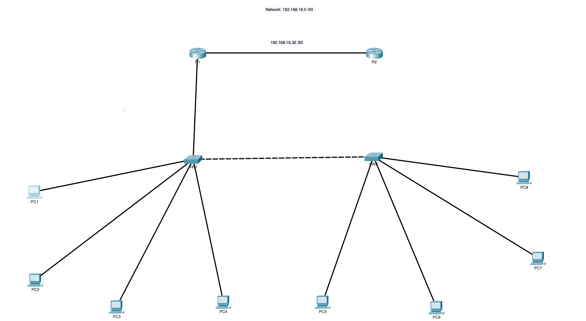

## NTP Addressing

| Device | NTP Role | Points To | Address Used |
|---|---|---|---|
| R2 | Master stratum 1 | Authoritative | N/A |
| R1 | Client | R2 G0/1 | 192.168.16.34 |
| SW1 | Client | R1 G0/0.99 | 192.168.16.49 |
| SW2 | Client | R1 G0/0.99 | 192.168.16.49 |

## Tools Used

- Cisco Packet Tracer
- Cisco IOS CLI

---

## Part 1 - SSH Version 2

---

### Why SSH and Not Telnet

Telnet transmits all data including usernames and passwords in plain text. Anyone with access to the network segment can capture Telnet traffic and read credentials directly. SSH encrypts the entire session including authentication using RSA key pairs making it impossible to read captured traffic without the private key.

In a professional network environment Telnet is never used for device management. SSH is the industry standard and is required for compliance with virtually every security framework including PCI-DSS, HIPAA, and NIST.

### What Three Things Are Required Before Generating RSA Keys

1. Hostname must be configured as it is part of the RSA key name
2. Domain name must be configured and combined with the hostname to create the fully qualified key name
3. A local username and password must exist. SSH requires authentication and login local must be set on VTY lines

All three prerequisites were completed in Lab 01. The domain name is the only new addition in this lab.

### Minimum RSA Key Size for SSH Version 2

1024 bits. Keys smaller than 1024 bits only support SSH version 1 which uses weaker encryption and has known vulnerabilities. SSH version 2 with a 1024-bit or larger key is the minimum acceptable configuration on any production network device.

---

### Step 1 - SSH Configuration on R1

```
enable
configure terminal
ip domain-name cisco.com
crypto key generate rsa modulus 1024
ip ssh version 2
ip ssh time-out 60
ip ssh authentication-retries 3
line vty 0 4
 transport input ssh
 login local
 exec-timeout 5 0
exit
copy running-config startup-config
```

| Command | Purpose |
|---|---|
| `ip domain-name cisco.com` | Required for RSA key generation |
| `crypto key generate rsa modulus 1024` | Generates the 1024-bit RSA key pair |
| `ip ssh version 2` | Forces SSH version 2, disables version 1 |
| `ip ssh time-out 60` | Drops unauthenticated sessions after 60 seconds |
| `ip ssh authentication-retries 3` | Allows 3 login attempts before disconnecting |
| `transport input ssh` | Blocks Telnet, allows SSH only on VTY lines |
| `login local` | Authenticates using the local username database |
| `exec-timeout 5 0` | Logs out idle sessions after 5 minutes |

**What command blocks Telnet and allows only SSH?**
`transport input ssh` By default VTY lines accept all connection types including insecure Telnet. This command restricts VTY access to SSH only. Any Telnet attempt is rejected at the line level before authentication.

**Verify:**

```
show ip ssh
```

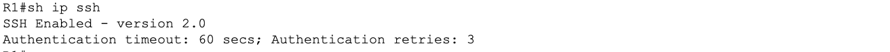

---

### Step 2 - SSH Configuration on R2

```
enable
configure terminal
ip domain-name cisco.com
crypto key generate rsa modulus 1024
ip ssh version 2
ip ssh time-out 60
ip ssh authentication-retries 3
line vty 0 4
 transport input ssh
 login local
 exec-timeout 5 0
exit
copy running-config startup-config
```

**Verify:**

```
show ip ssh
```

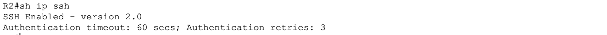

---

### Step 3 - SSH Configuration on SW1

```
enable
configure terminal
ip domain-name cisco.com
crypto key generate rsa modulus 1024
ip ssh version 2
ip ssh time-out 60
ip ssh authentication-retries 3
line vty 0 15
 transport input ssh
 login local
 exec-timeout 5 0
exit
copy running-config startup-config
```

Note: Switches use `line vty 0 15` to cover all 16 possible VTY sessions. Routers use `line vty 0 4` for 5 sessions. Leaving any VTY lines unconfigured can allow Telnet access through those lines even if the others are locked to SSH.

**Verify:**

```
show ip ssh
```


---

### Step 4 - SSH Configuration on SW2

```
enable
configure terminal
ip domain-name cisco.com
crypto key generate rsa modulus 1024
ip ssh version 2
ip ssh time-out 60
ip ssh authentication-retries 3
line vty 0 15
 transport input ssh
 login local
 exec-timeout 5 0
exit
copy running-config startup-config
```

**Verify:**

```
show ip ssh
```

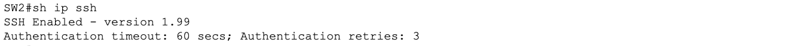

---

### SSH Connectivity Test

From R1 initiate SSH sessions to SW1 and R2 to confirm remote access is working:

**SSH from R1 to SW1:**

```
ssh -l admin 192.168.16.50
```

**SSH from R1 to R2:**

```
ssh -l admin 192.168.16.34
```

**What command do you use to SSH from one device to another in Packet Tracer?**

```
ssh -l username destination-ip
```

The -l flag specifies the login username. This is the standard IOS command for initiating outbound SSH sessions.

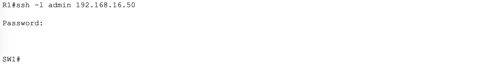

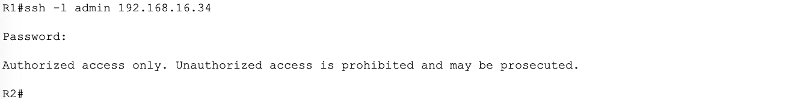

---

### SSH Verification Summary

| Device | SSH Version | Transport | Authentication |
|---|---|---|---|
| R1 | 2 | SSH only | Local database |
| R2 | 2 | SSH only | Local database |
| SW1 | 2 | SSH only | Local database |
| SW2 | 2 | SSH only | Local database |

---

## Part 2 - NTP Hierarchy Configuration

---

### Why NTP Matters

NTP synchronizes the clocks of all devices in the network to a single authoritative time source. Without it every device keeps its own independent clock which drifts over time. In a network with unsynchronized clocks:

- Syslog messages from different devices cannot be correlated because timestamps do not line up
- Security investigations become unreliable because the sequence of events cannot be accurately reconstructed
- Some security protocols and certificates depend on accurate time and will fail with clock skew
- OSPF and other protocol authentication mechanisms that use timestamps can behave unpredictably

In a larger enterprise network NTP is not optional. It is a fundamental operational requirement. Every managed device must sync to a common time source.

### What is a Stratum Level

Stratum defines how many hops a device is from a primary authoritative time source such as an atomic clock or GPS receiver. Stratum 1 is directly connected to an atomic clock. Stratum 2 syncs from stratum 1. Stratum 3 syncs from stratum 2. Each hop adds a small amount of time uncertainty so lower stratum numbers indicate more accurate time sources. Stratum 16 means unsynchronized.

In this lab R2 is configured as stratum 1 simulating a direct authoritative time source for the network.

---

### Step 1 - NTP Master on R2

```
enable
configure terminal
ntp master 1
exit
copy running-config startup-config
```

| Command | Purpose |
|---|---|
| `ntp master 1` | Designates R2 as an authoritative NTP server at stratum 1 |

**Verify:**

```
show ntp status
```

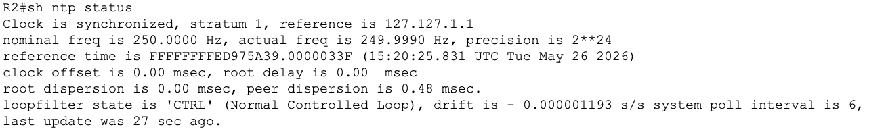

---

### Step 2 - NTP Client on R1 Syncing from R2

R1 points to R2's G0/1 point-to-point address as its time source:

```
enable
configure terminal
ntp server 192.168.16.34
exit
copy running-config startup-config
```

**Verify:**

```
show ntp status
show ntp associations
```

NTP synchronization may take a few minutes in Packet Tracer. The show ntp status output should eventually show synchronized and list R2's address as the reference.

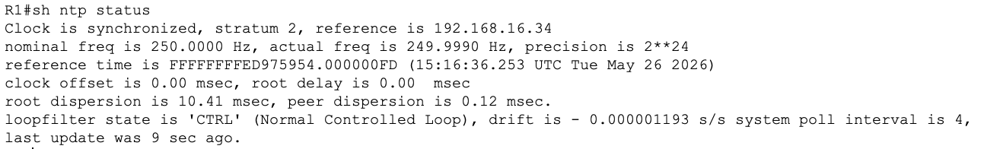

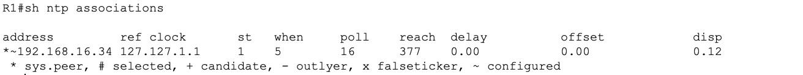

---

### Step 3 - NTP Client on SW1 Syncing from R1

SW1 points to R1's VLAN 99 management subinterface:

```
enable
configure terminal
ntp server 192.168.16.49
exit
copy running-config startup-config
```

**Verify:**

```
show ntp status
```

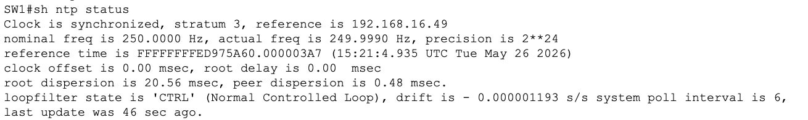

---

### Step 4 - NTP Client on SW2 Syncing from R1

SW2 also points to R1's VLAN 99 management subinterface:

```
enable
configure terminal
ntp server 192.168.16.49
exit
copy running-config startup-config
```

**Verify:**

```
show ntp status
```

---

### Reading show ntp status Output

**What does synchronized mean in show ntp status?**
It means the device has successfully contacted its configured NTP server and its local clock is now aligned with the server's time. The key fields to look for:

| Field | What it means |
|---|---|
| Clock is synchronized | Device has successfully synced |
| stratum 2 | R1 is two hops from the atomic clock source |
| reference is 192.168.16.34 | R1 is syncing from R2 |
| Clock is unsynchronized | Device has not yet synced or cannot reach NTP server |

---

### Running Config Verification

```
show running-config | include ntp
show running-config | include ssh
show running-config | include domain
show running-config | include transport
```

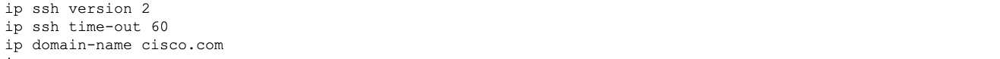

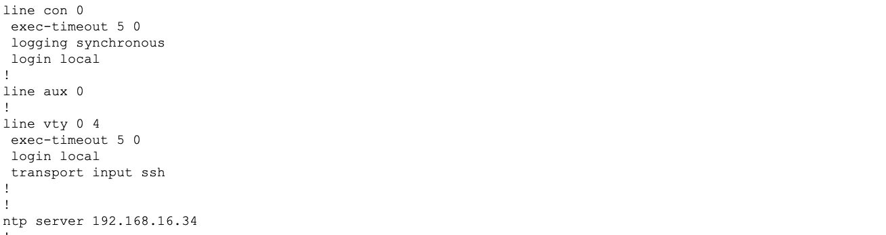

---

## Key Concepts

**What is the difference between login and login local on VTY lines?**

| Command | Behavior |
|---|---|
| `login` | Uses a single line password set with the password command |
| `login local` | Uses the full local username and password database |

Login local is more secure because it ties access to named accounts with individual passwords rather than a single shared line password.

**What does exec-timeout 5 0 mean?**
The two numbers represent minutes and seconds. exec-timeout 5 0 means 5 minutes and 0 seconds of idle time before the session is automatically disconnected. This prevents unattended logged-in sessions from remaining open indefinitely which is a security risk.

**Why configure SSH on all devices not just routers?**
Switches are also managed devices that require secure remote access. A switch running Telnet is just as vulnerable as a router running Telnet. Every managed device in a professional network runs SSH exclusively.

**What happens if you only configure line vty 0 4 on a switch?**
Lines 5 through 15 remain at their default which may allow Telnet connections. Always configure all VTY lines on switches with line vty 0 15 to ensure consistent security across all possible sessions.

---

## Lessons Learned

- All three prerequisites must be in place before RSA key generation: hostname, domain name, and local username. Missing any one of them causes the crypto key generate command to fail
- Switches require line vty 0 15 to cover all 16 VTY sessions. Configuring only 0 4, which is the VTY session limit on a router, leaves 11 lines potentially open to Telnet on the switch
- NTP synchronization does not happen instantly in Packet Tracer. It took a few minutes of simulation time before it showed syncrhonized status from the 'show ntp status' command. 
- The NTP hierarchy must be built top-down with R2 being configured as master before R1 can sync, and R1 must sync before the switches can sync from it
- SSH time-out and authentication-retries are important hardening settings that limit the window for brute force attacks on VTY lines
- Synchronized clocks are a prerequisite for meaningful syslog analysis so without NTP, log timestamps from different devices cannot be reliably correlated during an incident investigation
- Both transport input ssh on the VTY lines AND ip ssh version 2 are required to disable telnet and enable ssh.
- I learned that Packet Tracer initializes its internal clock to a default date of January 1990 because it has no connection to a real time source. NTP synchronization works correctly within the simulation but all devices sync to this fake historical date rather than the actual current time. So I manually corrected the clock on R2 using `clock set HH:MM:SS DD MONTH YYYY` in privileged exec mode and all NTP clients updated accordingly, however the clock resets back to 1990 every time Packet Tracer is closed and reopened. This is a known simulator limitation. On real Cisco hardware NTP master devices sync to GPS receivers or internet time servers and maintain accurate time permanently. 
