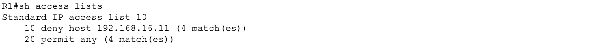
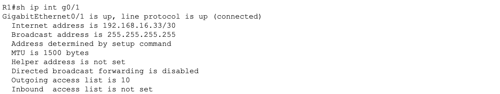
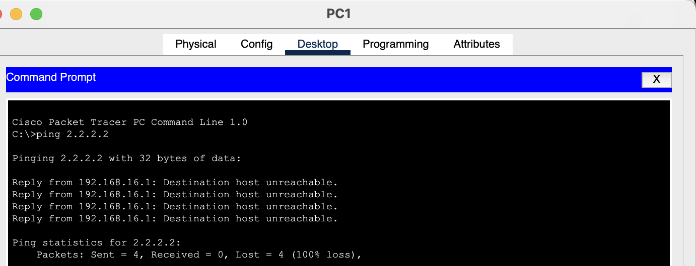
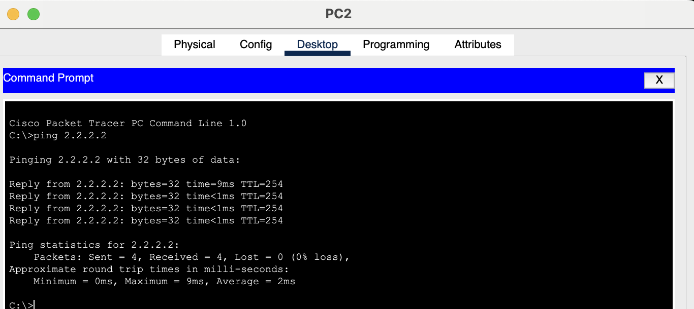
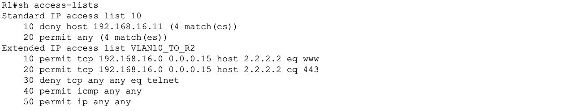
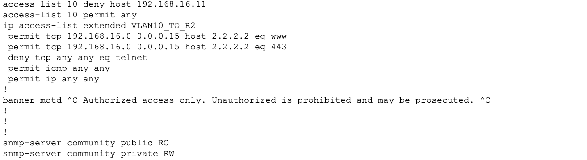
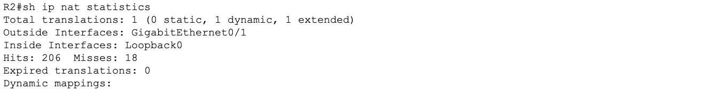
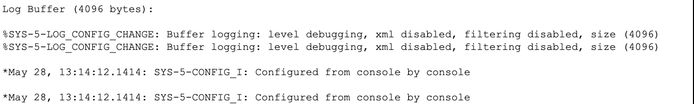

# Lab 10 - ACLs, NAT/PAT, Syslog, and SNMP Configuration

## Objective

Configure standard and extended Access Control Lists to filter traffic based on source IP and application type. Configure Port Address Translation on R2 to simulate internet-bound NAT. Enable syslog for centralized event logging with accurate timestamps. Configure SNMPv2c (SNMPv3 not supported on Packet Tracer) for network device monitoring.

## Devices Configured

| Device | Type | Role |
|---|---|---|
| R1 | Cisco ISR 4331 | Standard ACL, extended ACL, syslog, SNMP |
| R2 | Cisco ISR 4331 | NAT/PAT, syslog |

## Topology

All configuration is applied to R1 and R2 using the existing infrastructure built across all previous labs.


## Tools Used

- Cisco Packet Tracer
- Cisco IOS CLI

---

## Part 1 - Standard ACL

---

### What is a Standard ACL

A standard ACL filters traffic based on source IP address only. It cannot filter by destination, protocol, or port number. Because of this limitation standard ACLs must be placed as close to the destination as possible to avoid accidentally blocking traffic intended for other networks.

### Standard ACL Placement Rule

Place standard ACLs close to the destination. If placed near the source a standard ACL could block traffic to all destinations not just the intended one since it has no way to specify where traffic is going.

---

### Step 1 - Standard ACL Configuration on R1

The goal is to prevent PC1 from reaching R2's loopback 2.2.2.2 which simulates a remote protected network while allowing all other traffic through.

**Create the ACL:**

```
enable
configure terminal
access-list 10 deny host 192.168.16.2
access-list 10 permit any
```

**Apply outbound on R1 G0/1 toward R2:**

```
interface GigabitEthernet0/1
 ip access-group 10 out
exit
```

| Command | Purpose |
|---|---|
| `access-list 10 deny host 192.168.16.2` | Denies all traffic sourced from PC1 |
| `access-list 10 permit any` | Permits all other traffic |
| `ip access-group 10 out` | Applies the ACL outbound on the interface |

**Why outbound on G0/1?**
Standard ACLs are placed close to the destination. R2 is the destination so G0/1 facing R2 is the correct location. Outbound means traffic is filtered after routing as it exits toward R2.

**What is the implicit deny?**
Every ACL ends with an invisible deny any statement. Any traffic not explicitly permitted is dropped. The permit any statement is required to allow all non-PC1 traffic through. Without it the implicit deny would block everything.

**What is the difference between inbound and outbound ACL?**

| Direction | When it fires |
|---|---|
| Inbound | Traffic is filtered as it arrives on the interface before routing |
| Outbound | Traffic is filtered after routing as it leaves the interface |

**Verify:**

```
show access-lists
show ip interface GigabitEthernet0/1
```





---

### Standard ACL Test Results

**PC1 ping 2.2.2.2 -- expected FAIL:**

PC1 is 192.168.16.2 which matches the deny rule. Traffic is blocked at R1 G0/1 before reaching R2.



**PC2 ping 2.2.2.2 -- expected SUCCESS:**

PC2 is 192.168.16.3 which does not match the deny rule. It is permitted by the permit any statement and reaches R2 successfully.



---

## Part 2 - Extended ACL

---

### What is an Extended ACL

An extended ACL filters traffic based on source IP, destination IP, protocol, and port number. It is far more precise than a standard ACL and can allow or deny specific application traffic while leaving other traffic unaffected.

### Extended ACL Placement Rule

Place extended ACLs close to the source. Because extended ACLs specify both source and destination they can be placed near the source without risking blocking traffic to unintended destinations. Placing them near the source also reduces unnecessary traffic traversing the network.

---

### Step 1 - Extended ACL Configuration on R1

Requirements:
- Allow HTTP and HTTPS from VLAN 10 to reach R2 loopback 2.2.2.2
- Block all Telnet traffic from any source
- Allow ICMP for ping testing
- Allow all other IP traffic
- Apply close to the source on G0/0.10

**Create the named extended ACL:**

```
configure terminal
ip access-list extended VLAN10_TO_R2
 permit tcp 192.168.16.0 0.0.0.15 host 2.2.2.2 eq 80
 permit tcp 192.168.16.0 0.0.0.15 host 2.2.2.2 eq 443
 deny tcp any any eq 23
 permit icmp any any
 permit ip any any
exit
```

**Apply inbound on G0/0.10 close to the source:**

```
interface GigabitEthernet0/0.10
 ip access-group VLAN10_TO_R2 in
exit
```

**Extended ACL syntax order:**

```
permit/deny [protocol] [source] [wildcard] [destination] [wildcard] [eq port]
```

**Port number reference:**

| Service | Port |
|---|---|
| HTTP | 80 |
| HTTPS | 443 |
| Telnet | 23 |
| SSH | 22 |
| DNS | 53 |

**What protocol keyword is used for ping?**
ping uses ICMP echo request and echo reply messages. The permit icmp any any rule allows all ICMP traffic through for testing purposes.

**Verify:**

```
show access-lists
show ip interface GigabitEthernet0/0.10
```



**Save R1:**

```
end
copy running-config startup-config
```

---

### ACL Running Config Verification

```
show running-config | section access-list
show running-config | section ip access-list
```



---

## Part 3 - NAT/PAT on R2

---

### The Three Types of NAT

| Type | How it works | Use case |
|---|---|---|
| Static NAT | One private IP maps permanently to one public IP | Web servers needing a fixed public address |
| Dynamic NAT | Private IPs map to a pool of public IPs on demand | Organizations with a small block of public IPs |
| PAT (overload) | Many private IPs share one public IP using port numbers | Most home and enterprise internet connections |

PAT is the most widely deployed form of NAT in real networks. A single public IP address can support thousands of simultaneous connections by tracking each session using a unique source port number. When a device sends traffic the router records the inside local IP and port, replaces it with the outside global IP and a unique port, and reverses the translation for return traffic.

**What is inside local vs inside global?**

| Term | Meaning | Example |
|---|---|---|
| Inside local | Private IP of the internal device | 192.168.16.2 |
| Inside global | Public IP the device appears as externally | R2 G0/1 address |
| Outside local | Destination IP as seen from inside | 2.2.2.2 |
| Outside global | Destination IP as seen from outside | 2.2.2.2 |

---

### Step 1 - PAT Configuration on R2

In this topology R2 has no real internet-facing interface. PAT is simulated by defining G0/1 as the outside interface and the loopback as an inside network to demonstrate the configuration.

**Define inside and outside interfaces:**

```
enable
configure terminal
interface GigabitEthernet0/1
 ip nat outside
exit
interface Loopback0
 ip nat inside
exit
```

**Create ACL defining which addresses get translated:**

```
access-list 1 permit 192.168.16.0 0.0.0.255
```

**Configure PAT overload:**

```
ip nat inside source list 1 interface GigabitEthernet0/1 overload
exit
copy running-config startup-config
```

| Command | Purpose |
|---|---|
| `ip nat outside` | Marks the interface facing the internet |
| `ip nat inside` | Marks the interface facing the internal network |
| `access-list 1 permit` | Defines which inside addresses are eligible for translation |
| `overload` | Enables PAT so many inside addresses share one outside IP |

**What does the overload keyword do?**
Without overload each inside address requires its own unique outside address (one to one mapping). With overload many inside addresses share a single outside IP by differentiating connections using unique source port numbers. This is what makes PAT practical for real networks where public IP addresses are scarce.

**Verify:**

```
show ip nat translations
show ip nat statistics
```




---

## Part 4 - Syslog Configuration

---

### Why Syslog Matters

Syslog provides a centralized record of everything happening on a network device. Every interface state change, authentication attempt, ACL match, routing update, and system error generates a syslog message. Without syslog these events disappear as soon as they scroll off the console.

In a real enterprise network syslog messages are sent to a centralized syslog server where they are stored, indexed, and analyzed. This is the foundation of security monitoring and incident response. When something goes wrong the syslog record tells you exactly what happened, when it happened, and on which device.

### The 8 Syslog Severity Levels

| Level | Name | Examples |
|---|---|---|
| 0 | Emergencies | System is unusable |
| 1 | Alerts | Immediate action needed |
| 2 | Critical | Critical hardware failure |
| 3 | Errors | Interface errors, routing failures |
| 4 | Warnings | Configuration warnings |
| 5 | Notifications | Interface state changes |
| 6 | Informational | Normal operational messages |
| 7 | Debugging | Detailed protocol and packet information |

**What level captures the most messages?**
Debugging (level 7): configuring the logging level to debugging captures all messages from levels 0 through 7. It is the most verbose setting and is typically used only during troubleshooting because the volume of messages can be overwhelming in production.

---

### Step 1 - Syslog Configuration on R1 and R2

Run on both R1 and R2:

```
enable
configure terminal
logging on
logging console debugging
logging buffered debugging
service timestamps log datetime msec
exit
copy running-config startup-config
```

| Command | Purpose |
|---|---|
| `logging on` | Enables logging globally |
| `logging buffered debugging` | Stores all log messages in the router's memory buffer |
| `service timestamps log datetime msec` | Adds date, time, and milliseconds to every log message |

**Why are timestamps important?**
Without timestamps syslog messages have no time reference making it impossible to correlate events across multiple devices or build an accurate timeline during an incident. Millisecond precision is particularly useful when troubleshooting fast-moving events like routing convergence or interface flapping.

**Verify:**

```
show logging
```



---

## Part 5 - SNMP Configuration

---

### What is SNMP Used For

Simple Network Management Protocol allows a centralized network management system to monitor and manage network devices without logging into each one individually. A management station polls devices for performance statistics, interface counters, CPU and memory utilization, error rates, and configuration information. It can also receive unsolicited notifications called traps when significant events occur such as an interface going down or a threshold being exceeded.

In larger networks SNMP feeds data into dashboards and alerting systems that give network engineers real-time visibility across hundreds or thousands of devices simultaneously.

### The Three Versions of SNMP

| Version | Authentication | Encryption | Recommendation |
|---|---|---|---|
| SNMPv1 | Community string plain text | None | Never use |
| SNMPv2c | Community string plain text | None | Common but insecure |
| SNMPv3 | Username and password hashed | AES or DES | Always use in production |

**Which version is most secure and why?**
SNMPv3 is the only version that supports both message authentication and encryption. SNMPv1 and SNMPv2c transmit community strings in plain text which means anyone capturing network traffic can read them and potentially gain read-write access to device configurations. SNMPv3 uses hashed authentication and encrypted payloads making it the only version appropriate for production environments. Packet tracer only supports SNMPv2c. 

**What is a community string?**
A community string acts as a shared password between the SNMP agent on the device and the management station. Read-only (RO) strings allow the management station to poll for statistics. Read-write (RW) strings allow the management station to make configuration changes on the device. In SNMPv2c these strings are transmitted unencrypted.

**What port does SNMP use?**
UDP port 161 for SNMP polling requests and responses. UDP port 162 for SNMP traps sent from devices to the management station.

---

### Step 1 - SNMPv2c Configuration on R1

```
enable
configure terminal
snmp-server community public RO
snmp-server community private RW
snmp-server location Lab-Rack-01
snmp-server contact admin@cisco.com
snmp-server enable traps
exit
copy running-config startup-config
```

| Command | Purpose |
|---|---|
| `snmp-server community public RO` | Sets read-only community string to public |
| `snmp-server community private RW` | Sets read-write community string to private |
| `snmp-server contact` | Documents administrator contact information |
| `snmp-server enable traps` | Sends unsolicited notifications for significant events |

**Verify:**

```
show snmp
show snmp community
```
---

## Key Concepts

**What does a standard ACL filter on?**
Source IP address only. No destination, protocol, or port filtering is possible with a standard ACL.

**What does an extended ACL filter on?**
Source IP, destination IP, protocol, and port number. Extended ACLs provide granular traffic control at the application level.

**Why is PAT preferred over static or dynamic NAT in most networks?**
PAT allows hundreds or thousands of internal devices to share a single public IP address by differentiating connections using unique port numbers. This conserves public IP address space which is increasingly scarce with IPv4. Static and dynamic NAT require one public IP per inside address which does not scale in large organizations.

**What is the implicit deny in an ACL?**
Every ACL ends with an invisible deny any statement. Any traffic not explicitly matched by a permit rule is dropped. Always add a permit any or permit ip any any at the end of an ACL if you want unmatched traffic to pass through.

**Why is SNMPv3 required in production but SNMPv2c is still common?**
SNMPv2c is simpler to configure and is supported by all network management tools. Many organizations still use it on internal management networks that are not exposed to untrusted users. SNMPv3 adds complexity but is required in any environment with strict security compliance requirements. The CCNA exam tests both versions.

---

## Lessons Learned

- Standard ACLs filter only on source IP and must be placed close to the destination to avoid unintended blocking
- Extended ACLs filter on source, destination, protocol, and port and must be placed close to the source for efficiency
- The implicit deny at the end of every ACL silently drops all unmatched traffic so always add a permit any rule if unmatched traffic should be allowed through
- Named ACLs using ip access-list extended are preferred over numbered ACLs in professional environments because they are easier to identify, edit, and document
- PAT is the most scalable form of NAT because a single public IP supports thousands of simultaneous sessions through port tracking
- The overload keyword is what enables PAT; Without it NAT operates in one-to-one mode requiring a unique public IP for each inside address
- Always configure service timestamps log datetime msec before enabling logging. Syslog without timestamps is nearly useless for troubleshooting.
- SNMPv3 with authentication and encryption is the correct choice for any security-conscious organization. SNMPv2c community strings are transmitted in plain text and should never be used with default strings like public and private in a production environment.
- logging console debugging and snmp-server location are not fully supported 
in Packet Tracer. These commands work correctly on real Cisco IOS hardware. 
The core functionality of both syslog and SNMP operates as expected within 
the simulator's limitations
- Completing all 10 labs in sequence mirrors the exact order a professional network engineer would bring up an enterprise network from scratch: device hardening first, Layer 2 second, Layer 3 third, services and security last

