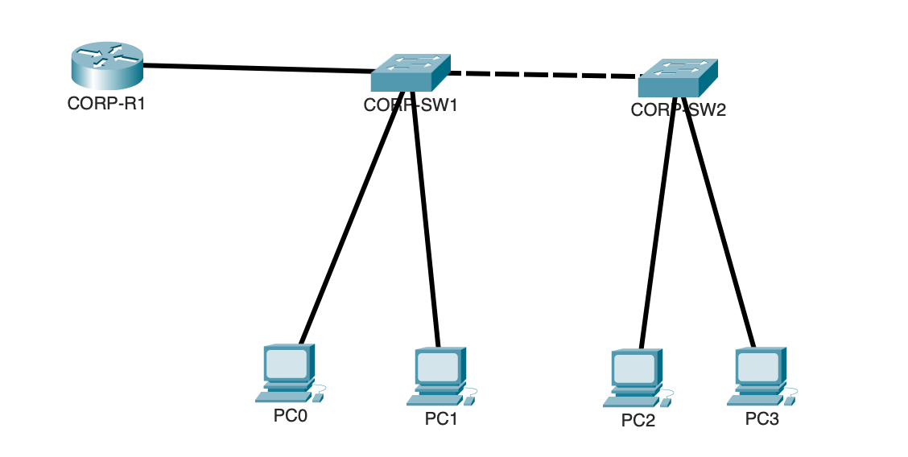

# Lab Review 02 - VLANs, Trunking, STP, and Layer 2 Security

## Objective

Build a two-switch topology from scratch covering VLAN segmentation, trunking, Spanning Tree root bridge control, and the three core Layer 2 security features: port security, DHCP snooping, and Dynamic ARP Inspection.

## Devices Configured

| Device | Type | Role |
|---|---|---|
| CORP-SW1 | Cisco 2960 | Access switch, STP root bridge for VLAN 10 and 20 |
| CORP-SW2 | Cisco 2960 | Access switch, non-root |

## Topology



## Addressing

| Device | Interface | IP Address |
|---|---|---|
| SW1 | Vlan99 | 192.168.99.2/24 |
| SW2 | Vlan99 | 192.168.99.3/24 |

---

## VLAN Configuration

Every VLAN segments the network into its own broadcast domain at Layer 2. Without VLANs every device on the switch shares one giant broadcast domain, meaning broadcast traffic from any device reaches every other device regardless of department or function. This is both a performance problem and a security problem where a compromised device in one department could directly see broadcast traffic from finance, HR, or any other group.

```
vlan 10
 name SALES
vlan 20
 name HR
vlan 99
 name MANAGEMENT
vlan 100
 name NATIVE
```

If a port is assigned to a VLAN that does not exist in the VLAN database, the port goes inactive and drops all traffic. The switch never auto-creates a VLAN just because a port references it.

**Security significance:** VLANs are the foundation of network segmentation. In a security model where HR, Finance, and general users are isolated into separate VLANs, a compromise in one VLAN does not automatically expose the others. This is the first layer of defense in depth at Layer 2.

---

## Access Port Configuration

```
interface range Fa0/1 - 2
 switchport mode access
 switchport access vlan 10
interface range Fa0/3 - 4
 switchport mode access
 switchport access vlan 20
```

| Command | Purpose |
|---|---|
| `switchport mode access` | Locks the port out of trunk negotiation entirely |
| `switchport access vlan` | Assigns the port to a specific broadcast domain |

Both commands are required every time. Skipping `switchport mode access` leaves the port capable of still attempting DTP negotiation even if you intend it strictly as an access port.

**Security significance:** Access ports are where end devices physically plug in. Locking them to access mode prevents someone from connecting a switch instead of a PC and attempting to negotiate a trunk to gain visibility into every VLAN on the network.

---

## Trunk Configuration

```
interface Fa0/2
 switchport mode trunk
 switchport trunk native vlan 100
 switchport trunk allowed vlan 10,20,99,100
 switchport nonegotiate
```

| Command | Purpose |
|---|---|
| `switchport mode trunk` | Forces the port into permanent trunk mode |
| `switchport trunk native vlan 100` | Defines which VLAN's traffic crosses untagged |
| `switchport trunk allowed vlan` | Restricts the trunk to only the VLANs actually needed |
| `switchport nonegotiate` | Disables DTP entirely |

DTP (Dynamic Trunking Protocol) is Cisco's mechanism for automatically negotiating whether a link should become a trunk. Disabling it with `switchport nonegotiate` removes the possibility of an attacker plugging a rogue switch into an access port and tricking DTP into forming a trunk automatically which would expose every VLAN allowed on that segment.

**Important troubleshooting note:** `switchport nonegotiate` will be rejected if the port is still in a dynamic negotiation mode. `switchport mode trunk` must be configured first to force the port into a static trunk state before `nonegotiate` can apply. Running these out of order produces a command rejection error.

**Security significance:** Restricting the allowed VLAN list on every trunk to only what is operationally needed limits the blast radius if a trunk is ever compromised. A trunk carrying all 4096 VLANs by default is an unnecessary exposure.

---

## Management SVI

```
interface vlan 99
 ip address 192.168.99.2 255.255.255.0
 no shutdown
```

An SVI (Switched Virtual Interface) is the only way a Layer 2 switch can have its own IP address for remote management. Unlike a physical port, an SVI has no physical signal to detect, so IOS defaults it to administratively down. It must be explicitly enabled.

**Security significance:** Placing switch management on a dedicated VLAN (99 in this case) rather than the default VLAN 1 separates administrative access from user traffic. If user VLANs are compromised, the management plane remains isolated.

---

## Spanning Tree Root Bridge Control

```
spanning-tree vlan 10 priority 4096
spanning-tree vlan 20 priority 4096
```

STP elects a root bridge by comparing Bridge IDs (priority plus MAC address) with the lowest Bridge ID wins. Every switch defaults to priority 32768. By manually lowering SW1's priority to 4096, SW1 is guaranteed to win the election regardless of MAC address, giving the network administrator deliberate control over the topology rather than leaving it to chance.

**Security and stability significance:** An uncontrolled root bridge election means any switch, including one an attacker introduces, could become the root bridge if it has a lower priority or MAC address, potentially redirecting traffic flow through a device the attacker controls. Manually pinning the root bridge prevents this.

---

## PortFast and BPDU Guard

```
interface range Fa0/2 - 3
 spanning-tree portfast
 spanning-tree bpduguard enable
```

PortFast skips the Listening and Learning STP states (30 seconds total) and moves an access port directly to Forwarding. This is safe only on ports connected to end devices, which never generate BPDUs.

BPDU Guard is the safety mechanism that makes PortFast secure. If a BPDU is ever received on a PortFast-enabled port, BPDU Guard immediately places that port into err-disabled state, fully shutting it down. Recovery requires manual intervention:

```
interface Fa0/1
 shutdown
 no shutdown
```

**Security significance:** Without BPDU Guard, an attacker could connect a switch to an access port and inject BPDUs in an attempt to manipulate the STP topology — potentially becoming the root bridge and intercepting traffic. BPDU Guard treats any BPDU on an access port as a hostile event and shuts the port down instantly.

---

## Port Security

```
interface range Fa0/2 - 3
 switchport port-seccrity
 switchport port-security maximum 1
 switchport port-security mac-address sticky
 switchport port-security violation shutdown
```

| Violation Mode | Port stays up | Logs violation | Drops unauthorized traffic |
|---|---|---|---|
| Protect | Yes | No | Yes |
| Restrict | Yes | Yes | Yes |
| Shutdown | No, goes err-disabled | Yes | Yes |

Sticky learning dynamically captures the first MAC address seen on the port and permanently saves it to the running configuration, locking the port to that specific device without requiring the administrator to manually type every MAC address in the network.

**Security significance:** Port security directly prevents MAC spoofing and unauthorized device connections at the access layer. Shutdown mode is the strongest option because it does not just drop unauthorized frames — it disables the port entirely, requiring administrator intervention before that port can be used again.

---

## DHCP Snooping

```
ip dhcp snooping
ip dhcp snooping vlan 10,20
interface Fa0/1
 ip dhcp snooping trust
```

DHCP snooping classifies every port as trusted or untrusted. Trusted ports (uplinks toward the legitimate DHCP server) are allowed to forward DHCP server responses. Untrusted ports (every access port facing an end device) can only forward client requests. Any DHCP server response arriving on an untrusted port is dropped immediately.

**Security significance:** This is the direct countermeasure to rogue DHCP server attacks. Without it, any device plugged into an access port could begin handing out fake IP addresses, malicious default gateways, or malicious DNS servers, effectively performing a man-in-the-middle attack against every new client on the network.

---

## Dynamic ARP Inspection

```
ip arp inspection vlan 10,20
interface Fa0/24
 ip arp inspection trust
```

DAI intercepts every ARP packet on untrusted ports and validates the claimed IP-to-MAC mapping against the DHCP snooping binding table. If the mapping does not match a recorded lease, the ARP packet is dropped before it can poison any device's ARP cache.

DHCP snooping must always be configured before DAI. DAI has no independent record of valid mappings and relies entirely on the binding table that DHCP snooping builds. Enabling DAI without a populated binding table causes all ARP traffic on untrusted ports to be dropped, including legitimate traffic.

**Security significance:** DAI is the direct countermeasure to ARP spoofing, one of the most common Layer 2 attacks used to redirect traffic through an attacker's machine for interception or man-in-the-middle attacks.

---

## How These Features Work Together

These three Layer 2 security controls are designed to be deployed as a set, not individually:

| Feature | What it stops | Depends on |
|---|---|---|
| Port Security | Unauthorized devices connecting via MAC restriction | Nothing — standalone |
| DHCP Snooping | Rogue DHCP servers handing out fake addresses | Nothing — standalone, but builds the binding table |
| DAI | ARP spoofing and man-in-the-middle attacks | DHCP Snooping binding table |

Port security stops the wrong device from connecting at all. DHCP snooping stops a connected device from impersonating infrastructure. DAI stops a connected device from impersonating another host's identity at Layer 2. Together they form a layered defense against the most common attacks that occur entirely within the local network segment, before traffic ever reaches a router or firewall.

---

## Verification Commands

```
show vlan brief
show interfaces trunk
show spanning-tree vlan 10
show port-security
show ip dhcp snooping
show ip arp inspection
```

| Command | What it confirms |
|---|---|
| `show vlan brief` | VLANs exist and ports are assigned correctly |
| `show interfaces trunk` | Trunk is active, native VLAN matches both sides, correct allowed VLANs |
| `show spanning-tree vlan 10` | Root bridge identity and port states across the topology |
| `show port-security` | Violation count, max MACs allowed, currently learned MAC per port |
| `show ip dhcp snooping` | Snooping enabled, correct VLANs, correct trusted ports |
| `show ip arp inspection` | DAI enabled, correct VLANs, correct trusted ports |

---

## Troubleshooting Encountered

**switchport nonegotiate rejected:** The command failed with "Conflict between nonegotiate and dynamic status" because the port was still in a dynamic negotiation mode when nonegotiate was attempted. Fixed by running `switchport mode trunk` first to force a static trunk state, then applying `switchport nonegotiate` afterward. Order of operations matters for this command sequence.

**Native VLAN mismatch (%CDP-4-NATIVE_VLAN_MISMATCH):** CDP reported a native VLAN mismatch between SW1 Fa0/2 (VLAN 100) and SW2 Fa0/1 (VLAN 1) even though the native VLAN command had been entered on both sides. The root cause was the interrupted command sequence from the nonegotiate rejection: the native VLAN command on SW2 never fully applied before the session moved on. Fixed by re-running the complete trunk configuration sequence on SW2 Fa0/1 in the correct order: mode trunk, native vlan, allowed vlan, nonegotiate. Verified with show interfaces trunk on both switches until native VLAN matched on both ends.

---

## Lessons Learned

The order of configuration commands on a trunk port is not arbitrary: `switchport mode trunk` must always be configured before `switchport nonegotiate`, or IOS rejects the command outright. This is an easy mistake to make when typing commands quickly and is a realistic scenario for CCNA exam troubleshooting questions.

A native VLAN mismatch does not necessarily mean the command was never entered. It can also mean a command sequence was interrupted partway through, leaving the configuration in an inconsistent state. Always verify with `show interfaces trunk` on both ends rather than assuming a command succeeded just because no error appeared for it specifically.

DHCP snooping and DAI are not independent features. DAI is only as good as the binding table DHCP snooping builds. This dependency is one of the most commonly tested relationships in Layer 2 security questions, and configuring them out of order will cause real connectivity problems, not just a configuration warning.

PortFast and BPDU Guard should always be paired together on access ports. PortFast alone removes a safety mechanism without adding a replacement — BPDU Guard is what makes the speed gain from PortFast safe to deploy in a real environment.