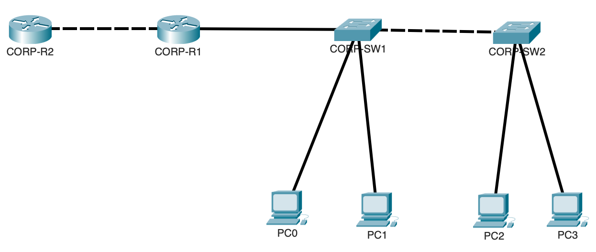

# Lab Review 03 - Router on a Stick, DHCP Server, and Inter-VLAN Routing

## Objective

Extend the Day 2 switching topology by introducing R1 as a router on a stick and R2 as a simulated upstream router. Configure R1 to perform inter-VLAN routing and serve DHCP to all clients, then establish reachability to R2 using a static route. This lab is the bridge between Layer 2 switching and Layer 3 routing; the point where VLANs stop being isolated islands and become a routed network.

## Devices Configured

| Device | Type | Role |
|---|---|---|
| CORP-SW1 | Cisco 2960 | Access switch, trunk to R1 |
| CORP-SW2 | Cisco 2960 | Access switch, trunk to SW1 |
| R1 | Cisco router | Router on a stick, DHCP server |
| R2 | Cisco router | Simulated upstream / internet router |

## Topology



## Addressing

| Network | Subnet | Gateway |
|---|---|---|
| VLAN 10 | 192.168.10.0/24 | R1 G0/0.10 = .1 |
| VLAN 20 | 192.168.20.0/24 | R1 G0/0.20 = .1 |
| VLAN 99 management | 192.168.99.0/24 | R1 G0/0.99 = .1 |
| Point-to-point R1 to R2 | 10.0.0.0/30 | R1 = .1, R2 = .2 |

| Device | VLAN | Switch | Addressing Method |
|---|---|---|---|
| PC1 | 10 | SW1 | DHCP |
| PC2 | 20 | SW1 | DHCP |
| PC3 | 10 | SW2 | DHCP |
| PC4 | 20 | SW2 | DHCP |

---

## Why This Lab Matters

Every lab before this one operated entirely at Layer 2; VLANs separated traffic, trunks carried it between switches, but nothing could cross a VLAN boundary because no Layer 3 device existed to route between them. This lab introduces the router as the missing piece. Once R1 is configured correctly, VLAN 10 and VLAN 20 stop being permanently isolated and become two networks that can communicate under the router's control; which is exactly the point. Routing is what makes segmentation useful instead of just restrictive: traffic between departments can be allowed deliberately rather than being impossible by accident.

---

## Configuration Steps

---

### Remove Physical IP from R1 G0/0

```
interface GigabitEthernet0/0
 no ip address
 no shutdown
```

**Why this matters:** In a router on a stick design, the physical interface itself never carries an IP address. It exists purely as a trunk carrier; a single physical cable that all VLAN traffic flows through. All actual Layer 3 addressing lives on the subinterfaces created beneath it. The physical interface still needs `no shutdown` because if the physical link itself is down, none of the subinterfaces above it can come up regardless of their own configuration.

---

### Create Subinterfaces for Each VLAN

```
interface GigabitEthernet0/0.10
 encapsulation dot1Q 10
 ip address 192.168.10.1 255.255.255.0

interface GigabitEthernet0/0.20
 encapsulation dot1Q 20
 ip address 192.168.20.1 255.255.255.0

interface GigabitEthernet0/0.99
 encapsulation dot1Q 99
 ip address 192.168.99.1 255.255.255.0

interface GigabitEthernet0/0.100
 encapsulation dot1Q 100 native
```

| Command | Purpose |
|---|---|
| `encapsulation dot1Q 10` | Tells the subinterface to only process frames tagged with VLAN 10 |
| `ip address` | Assigns the gateway address PCs in that VLAN will use |
| `encapsulation dot1Q 100 native` | Identifies VLAN 100 as the native VLAN; untagged frames on the trunk belong here |

**Why this matters:** Each subinterface is a logical router interface bound to one VLAN tag. When a frame arrives on the physical trunk tagged VLAN 10, IOS routes it to the G0/0.10 subinterface as if it had arrived on a dedicated physical port for that VLAN. This is what allows a single physical interface to act as the gateway for every VLAN simultaneously; the VLAN tag is effectively standing in for separate cables. The native VLAN subinterface needs no IP address because it only exists to formally declare which VLAN's traffic crosses the trunk untagged, matching what was configured on the switch side in Day 2.

---

### Configure the Point-to-Point Link Between R1 and R2

```
interface GigabitEthernet0/1
 ip address 10.0.0.1 255.255.255.252
 no shutdown
```

On R2:
```
interface GigabitEthernet0/1
 ip address 10.0.0.2 255.255.255.252
 no shutdown
```

**Why this matters:** A /30 subnet provides exactly two usable host addresses, which is the precise requirement for a link connecting exactly two routers. Using anything larger wastes address space for no benefit; a point-to-point link will never have more than two endpoints, so allocating a /24 or even a /29 here would be inefficient design. This is the standard convention used throughout enterprise WAN links.

---

### Configure DHCP Server on R1

```
ip dhcp excluded-address 192.168.10.1 192.168.10.10
ip dhcp excluded-address 192.168.20.1 192.168.20.10

ip dhcp pool VLAN10_POOL
 network 192.168.10.0 255.255.255.0
 default-router 192.168.10.1
 dns-server 8.8.8.8

ip dhcp pool VLAN20_POOL
 network 192.168.20.0 255.255.255.0
 default-router 192.168.20.1
 dns-server 8.8.8.8
```

**Why exclusions must come first:** DHCP pool creation does not retroactively check for already-excluded ranges if the exclusion command runs afterward; there is a real risk that the DHCP process could hand out a gateway address to a client before the exclusion takes effect, depending on timing and platform. Always exclude first as a hard rule, not just a best practice.

**Why this matters in the bigger picture:** Manually configuring static IPs on every client in a real organization with hundreds or thousands of devices is operationally impossible. DHCP is what makes a routed network scale; new devices join, request an address, and are immediately functional with the correct gateway and DNS server without any administrator involvement. This is foundational infrastructure for everything from a small office to an enterprise campus.

---

### Update Switch Default Gateways

```
ip default-gateway 192.168.99.1
```

Run on both SW1 and SW2.

**Why this matters:** A switch's SVI only knows about its own directly connected subnet. The moment a switch needs to reach anything outside that subnet; a remote management station, a syslog server, an NTP server; it has no routing table to consult. The default gateway is the switch's single instruction for "send anything you don't recognize to this address." Routers do not need this because they build a full routing table through static routes or dynamic routing protocols; switches operating only at Layer 2 management have no equivalent mechanism.

---

### Configure Static Route on R2

```
ip route 192.168.0.0 255.255.0.0 10.0.0.1
```

**Why this matters:** R2 has no inherent knowledge of any network beyond its own directly connected interfaces. Without this route, any traffic R2 receives that's destined for 192.168.10.0/24 or 192.168.20.0/24 would be dropped because R2 has no path back to reply. The static route summarizes both VLAN subnets into a single /16 entry pointing at R1, which is both more efficient than two separate routes and demonstrates route summarization; a real technique used to keep routing tables smaller in larger networks. Static routes carry an administrative distance of 1, making them highly preferred over any dynamically learned route to the same destination unless something more specific exists.

---

## Verification

```
show ip interface brief
```

All four R1 subinterfaces plus G0/1 must show up/up. A subinterface can show down/down even when the physical interface is up if the corresponding VLAN does not exist in the switch's VLAN database, or if the trunk does not actually carry that VLAN; this is a common and exam-relevant troubleshooting scenario.

```
show ip dhcp binding
```

Confirms every PC received a lease with the correct IP, MAC, and lease time. This table also doubles as the reference DAI uses for ARP validation, tying this lab directly back to the Layer 2 security configured in Day 2.

```
show ip route
```

| Code | Meaning |
|---|---|
| C | Directly connected network |
| L | Local — the router's own specific interface address within that connected network |
| S | Static route, manually configured |

The distinction between C and L for the same interface trips up a lot of candidates: the C route represents the entire subnet as reachable through that interface, while the L route is the single /32 host address of the interface itself. Both exist simultaneously for every connected interface.

---

## Connectivity Testing

Four directions of inter-VLAN traffic were tested:

| Test | Path | Requires Routing? |
|---|---|---|
| PC1 to PC3 | Same VLAN (10), different switch | No — pure Layer 2 trunk forwarding |
| PC2 to PC4 | Same VLAN (20), different switch | No — pure Layer 2 trunk forwarding |
| PC1 to PC2 | Different VLAN, same switch | Yes — routed through R1 |
| PC1 to PC4 | Different VLAN, different switch | Yes — routed through R1, crosses two trunks |

This matrix is the clearest possible demonstration of the Layer 2 versus Layer 3 distinction: traffic within the same VLAN never touches R1 regardless of physical location, while traffic crossing a VLAN boundary always goes through R1 regardless of how physically close the two devices are.

R2 reachability was confirmed by pinging R2's G0/1 address from PC1 after the static route was applied, proving the static route correctly returns traffic to the PC subnets.

---

## Key Concepts

**Does the physical interface need an IP address?**
No. In router on a stick, the physical interface is a pure trunk carrier with no Layer 3 role of its own. All addressing lives entirely on the subinterfaces.

**Why is router on a stick considered a limitation in larger networks?**
Every VLAN's traffic funnels through one physical link to reach the router. As traffic volume and VLAN count grow, that single link becomes a bottleneck. Enterprise networks generally replace this design with Layer 3 switches that route between VLANs internally at much higher throughput, reserving router on a stick for smaller deployments or WAN edge scenarios.

**What administrative distance does a static route carry?**
1; second only to directly connected routes at 0. This is intentionally very low, meaning a static route will always be preferred over a dynamically learned route to the same destination unless a more specific match exists.

---

## Lessons Learned

The relationship between subinterface encapsulation and the switch-side trunk allowed-VLAN list is a two-sided dependency;  if either side is missing the VLAN, traffic silently fails to route even though every other piece of configuration looks correct. This reinforces why `show interfaces trunk` on the switch and `show ip interface brief` on the router should always be checked together when a VLAN is not routing as expected.

Excluding addresses before creating DHCP pools is not just good practice but a real operational safeguard; the order genuinely affects whether a gateway address could theoretically be leased to a client. Building this habit now prevents a subtle and hard-to-diagnose problem later.

The Layer 2 versus Layer 3 distinction tested by the four-direction ping matrix is one of the cleanest mental models for understanding when a router is actually involved in a traffic flow; same VLAN traffic never touches the router no matter the physical topology, while crossing a VLAN boundary always does, even between two devices on the very same switch.