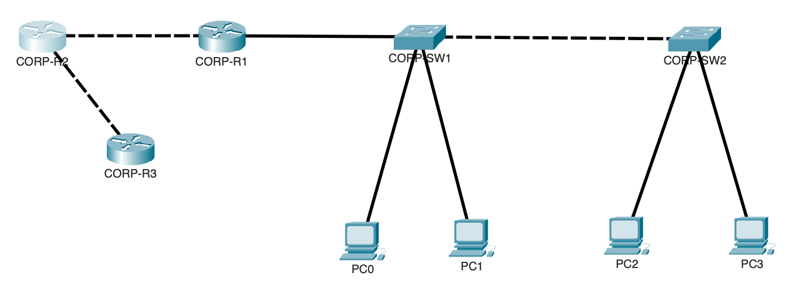

# Lab Review 04 - OSPFv2 Three-Router Topology

## Objective

Configure OSPFv2 across a three-router topology. This lab covers loopback interfaces for router stability, manual router ID assignment, passive interface configuration, reference bandwidth standardization, and default route advertisement into OSPF.

## Devices Configured

| Device | Type | Router ID | Loopback |
|---|---|---|---|
| CORP-R1 | Cisco ISR | 1.1.1.1 | 1.1.1.1/32 |
| CORP-R2 | Cisco ISR | 2.2.2.2 | 2.2.2.2/32 |
| CORP-R3 | Cisco ISR | 3.3.3.3 | 3.3.3.3/32 |

## Topology



## Addressing

| Segment | Subnet | Device A | Device B |
|---|---|---|---|
| R1 to R2 point-to-point | 10.0.0.0/30 | R1 G0/1 = 10.0.0.1 | R2 G0/1 = 10.0.0.2 |
| R2 to R3 point-to-point | 10.0.1.0/30 | R2 G0/0 = 10.0.1.1 | R3 G0/0 = 10.0.1.2 |
| R1 LAN VLAN 10 | 192.168.10.0/24 | R1 G0/0.10 = .1 | PCs via DHCP |
| R1 LAN VLAN 20 | 192.168.20.0/24 | R1 G0/0.20 = .1 | PCs via DHCP |
| R3 LAN | 192.168.30.0/24 | R3 G0/1 = .1 | PCs via DHCP |
| R1 loopback | 1.1.1.1/32 | R1 Lo0 | |
| R2 loopback | 2.2.2.2/32 | R2 Lo0 | |
| R3 loopback | 3.3.3.3/32 | R3 Lo0 | |

---

## Full Configuration

### CORP-R1

```
interface Loopback0
 ip address 1.1.1.1 255.255.255.255
 description R1 Router ID and stability loopback

interface GigabitEthernet0/1
 ip address 10.0.0.1 255.255.255.252
 description Link to CORP-R2
 no shutdown

router ospf 1
 router-id 1.1.1.1
 network 192.168.10.0 0.0.0.255 area 0
 network 192.168.20.0 0.0.0.255 area 0
 network 192.168.99.0 0.0.0.255 area 0
 network 10.0.0.0 0.0.0.3 area 0
 network 1.1.1.1 0.0.0.0 area 0
 passive-interface GigabitEthernet0/0.10
 passive-interface GigabitEthernet0/0.20
 passive-interface GigabitEthernet0/0.99
 passive-interface GigabitEthernet0/0.100
 passive-interface Loopback0
 auto-cost reference-bandwidth 1000
```

### CORP-R2

```
interface Loopback0
 ip address 2.2.2.2 255.255.255.255
 description R2 Router ID and stability loopback

interface GigabitEthernet0/1
 ip address 10.0.0.2 255.255.255.252
 description Link to CORP-R1
 no shutdown

interface GigabitEthernet0/0
 ip address 10.0.1.1 255.255.255.252
 description Link to CORP-R3
 no shutdown

router ospf 1
 router-id 2.2.2.2
 network 10.0.0.0 0.0.0.3 area 0
 network 10.0.1.0 0.0.0.3 area 0
 network 2.2.2.2 0.0.0.0 area 0
 passive-interface Loopback0
 auto-cost reference-bandwidth 1000
```

### CORP-R3

```
interface Loopback0
 ip address 3.3.3.3 255.255.255.255
 description R3 Router ID and stability loopback

interface GigabitEthernet0/0
 ip address 10.0.1.2 255.255.255.252
 description Link to CORP-R2
 no shutdown

interface GigabitEthernet0/1
 ip address 192.168.30.1 255.255.255.0
 description R3 LAN
 no shutdown

ip route 0.0.0.0 0.0.0.0 Loopback0

router ospf 1
 router-id 3.3.3.3
 network 10.0.1.0 0.0.0.3 area 0
 network 192.168.30.0 0.0.0.255 area 0
 network 3.3.3.3 0.0.0.0 area 0
 passive-interface GigabitEthernet0/1
 passive-interface Loopback0
 auto-cost reference-bandwidth 1000
 default-information originate
```

---

## Most Important Commands and What They Do

| Command | Purpose |
|---|---|
| `interface Loopback0` | Creates a permanent virtual interface that never goes down |
| `ip address 1.1.1.1 255.255.255.255` | Assigns a /32 host address to the loopback |
| `router ospf 1` | Starts the OSPF process with a locally significant process ID |
| `router-id 1.1.1.1` | Manually pins the router identity to the loopback address |
| `network X.X.X.X wildcard area 0` | Enables OSPF on matching interfaces and advertises their networks |
| `passive-interface` | Stops hello packets on an interface while still advertising its network |
| `auto-cost reference-bandwidth 1000` | Standardizes cost calculation across all routers in the domain |
| `ip route 0.0.0.0 0.0.0.0 Loopback0` | Creates the default route that OSPF will advertise to the network |
| `default-information originate` | Injects the default route into the OSPF domain |
| `show ip ospf neighbor` | Verifies neighbor relationships and their states |
| `show ip route ospf` | Displays only OSPF learned routes in the routing table |
| `show ip protocols` | Confirms OSPF process details including networks and passive interfaces |

---

## Key Concepts Reviewed

**Why loopbacks must be configured before starting OSPF:**
The OSPF process needs a router ID the moment it starts. If no loopback exists and no manual router ID is set, IOS automatically selects the highest active physical interface IP as the router ID. If that physical interface later goes down the router ID changes, OSPF tears down all neighbor relationships, and the entire routing table for that router is temporarily lost. A loopback is always up as long as the router is powered on and has no physical component that can fail, making it a permanent and stable identity for the router. Configuring loopbacks first and manually assigning the router ID eliminates this category of failure entirely.

**Why /32 is always used for loopback addresses:**
A loopback interface represents a single endpoint: the router itself. A /32 subnet mask means exactly one address with no network address, no broadcast address, and no other hosts. Using anything larger than /32 would imply a network of hosts when the loopback is actually a single virtual point. This is both the most precise and most efficient assignment for an interface that represents one device.

**Why the router ID must always be set manually:**
Automatic router ID selection is non-deterministic. The router picks whichever physical interface happens to have the highest IP at the time the OSPF process starts, and that selection can change if interfaces are added, removed, or go down. In a production network where stability and predictability are requirements, a router changing its identity unexpectedly is a serious operational problem. Manual assignment to a loopback address guarantees that the router ID never changes under any circumstance short of a complete configuration reset.

**What the network command actually does:**
The network command does not advertise a specific subnet into OSPF. What it actually does is identify which local interfaces fall within the specified range and then enables OSPF on those interfaces and advertises their connected networks. The wildcard mask is the inverse of the subnet mask: /28 uses 0.0.0.15, /30 uses 0.0.0.3, /32 uses 0.0.0.0, and /24 uses 0.0.0.255. A wildcard of 0.0.0.0 matches exactly one address, which is why it is used to match a loopback with pinpoint precision.

**What passive interfaces do and why they matter:**
A passive interface stops OSPF from sending hello packets out that interface. This is important for two reasons. First, there are no OSPF routers on LAN-facing interfaces or loopbacks, so sending hellos there wastes bandwidth and generates unnecessary OSPF traffic. Second, sending hello packets out every interface including LAN interfaces exposes routing protocol information to end devices, which is both unnecessary and a security concern in environments where network topology should not be visible to users. The network is still advertised into OSPF; neighbor formation is simply disabled.

**How reference bandwidth affects OSPF cost and why it must match on all routers:**
OSPF cost is calculated as reference bandwidth divided by interface bandwidth. The default reference bandwidth is 100 Mbps. With the default setting a FastEthernet interface at 100 Mbps and a GigabitEthernet interface at 1000 Mbps both calculate to a cost of 1, making them appear identical to OSPF when making path decisions. Setting the reference bandwidth to 1000 Mbps corrects this: FastEthernet becomes cost 10 and GigabitEthernet becomes cost 1, allowing OSPF to correctly prefer the faster link. This value must be identical on every router in the OSPF domain or each router calculates costs using a different formula and path selection becomes inconsistent and unpredictable.

**How the default route reaches R1 and how it appears in the routing table:**
R3 has a static default route pointing to its own loopback to simulate an internet exit. The `default-information originate` command instructs R3 to inject that default route into the OSPF domain as an external route. R2 receives it through the OSPF update process and passes it along to R1. R1 installs it in its routing table as an OSPF external type 2 route which appears as:

```
O*E2 0.0.0.0/0 [110/1] via 10.0.0.2
```

The O indicates OSPF, E2 indicates external type 2 (redistributed from outside the OSPF domain), the asterisk marks it as the candidate default route, 110 is the OSPF administrative distance, and 1 is the metric assigned to the external route.

**What OSPF neighbor states mean and why FULL is the only acceptable operational state:**
OSPF neighbors progress through eight states before routes are exchanged: Down, Init, 2-Way, Exstart, Exchange, Loading, and Full. A neighbor stuck at any state below Full means the routers have not completed their database exchange and no routes from that neighbor are being used. The most common stuck states and their causes are Exstart indicating an MTU mismatch between the two interfaces, Init indicating hellos are being received but the neighbor has not yet seen its own router ID in the received hello, and Exchange indicating an authentication mismatch or database descriptor packet problem.

---

## OSPF Neighbor States Reference

| State | What is happening |
|---|---|
| Down | No hellos received from this neighbor |
| Init | Hello received but local router ID not yet seen in neighbor hello |
| 2-Way | Bidirectional communication confirmed, DR/BDR election occurs here |
| Exstart | Master and slave negotiation for database exchange begins |
| Exchange | Database descriptor packets being exchanged |
| Loading | Link state requests being sent and processed |
| Full | Complete synchronization achieved, routes are now being exchanged |

---

## Routing Table Reference

| Code | Meaning |
|---|---|
| C | Directly connected network |
| L | Local, the specific /32 address of the router's own interface |
| S | Static route, manually configured |
| O | OSPF intra-area route |
| O E2 | OSPF external type 2, redistributed from outside the OSPF domain |
| O*E2 | OSPF external type 2 candidate default route |

---

## Verification Commands

```
show ip ospf neighbor
show ip route ospf
show ip protocols
show ip ospf interface brief
show ip ospf
```

| Command | What it confirms |
|---|---|
| `show ip ospf neighbor` | Neighbor relationships and state, must show Full |
| `show ip route ospf` | All OSPF learned routes including the O*E2 default route |
| `show ip protocols` | Process ID, router ID, networks advertised, passive interfaces, reference bandwidth |
| `show ip ospf interface brief` | Which interfaces are running OSPF and their cost values |
| `show ip ospf` | Process details including router ID, SPF calculation counts, area information |

---

## Lessons Learned

The order of configuration in this lab is not arbitrary. Loopbacks must exist before the OSPF process starts so that the manual router ID assignment has a stable address to reference. If OSPF is started before the loopback is created and no manual router ID is set, IOS picks an address automatically, and then when the loopback is created later the router ID does not automatically update to reflect it. The OSPF process must be cleared or the router must be reloaded for the ID to change, which disrupts existing neighbor relationships. The correct habit is loopbacks first, manual router ID second, then OSPF network statements.

The reference bandwidth setting is one of the most commonly misconfigured OSPF parameters in real networks and on the exam. It looks optional because OSPF functions without it, but the consequences of leaving it at the default 100 Mbps are real: any interface faster than 100 Mbps gets an identical cost of 1, OSPF cannot distinguish between a 100 Mbps path and a 10 Gbps path, and path selection becomes purely based on hop count rather than actual link speed. Setting it to 1000 Mbps on every router in the domain is a mandatory step in any professional OSPF deployment.

The passive interface configuration reinforces a broader principle in network engineering: never run a protocol on an interface where it serves no function. OSPF hellos going out toward end user devices waste bandwidth, expose routing information unnecessarily, and could allow a misconfigured or malicious device on the LAN to attempt OSPF neighbor formation. Passive interfaces enforce the boundary between the routing domain and the access layer.

The `default-information originate` command only works when the advertising router actually has a default route in its own routing table. Configuring the command alone without the static `ip route 0.0.0.0 0.0.0.0` entry results in the default route not being advertised regardless of what the configuration shows. This is a commonly tested OSPF troubleshooting scenario on the exam.